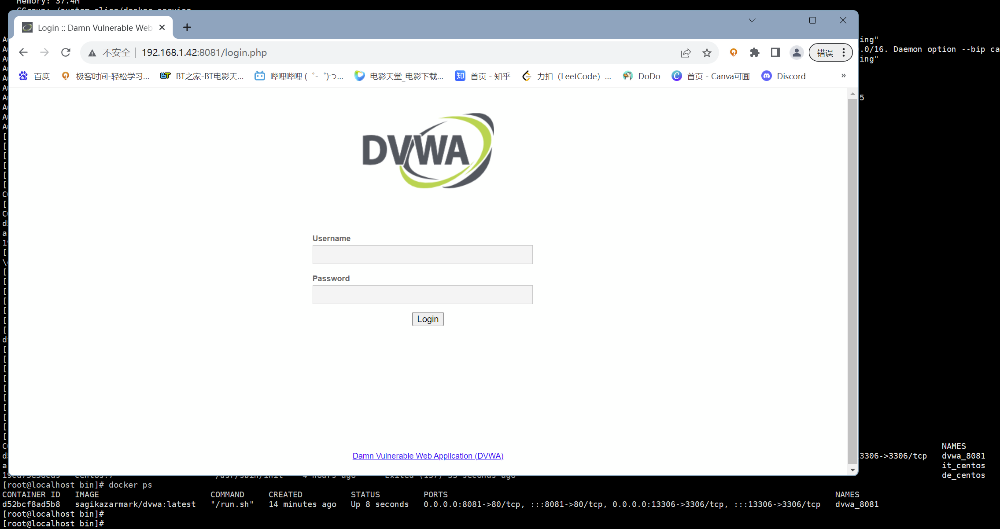
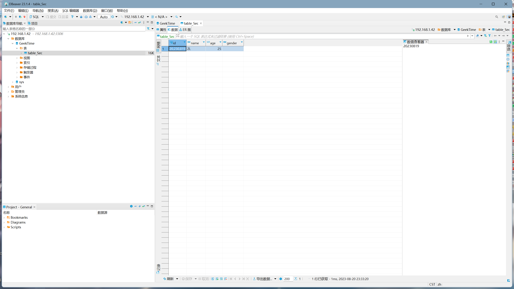
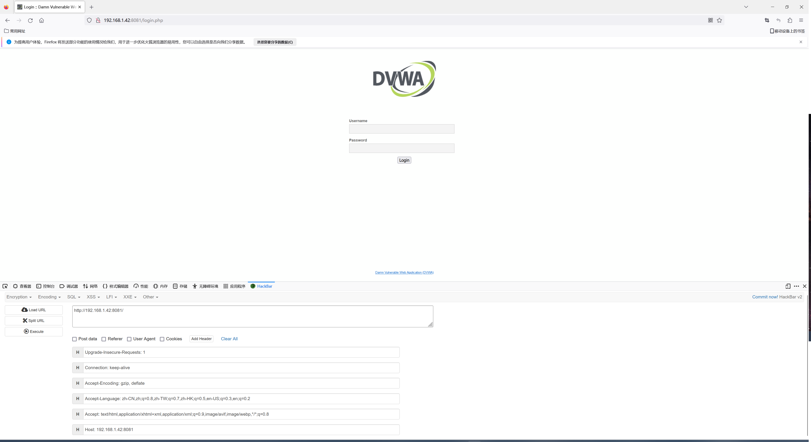

## 1、在 docker 中分别以后台方式和交互方式启动 centos，对比启动后的容器状态，实现退出容器也能保持其运行状态。

后台方式

```shell
[root@localhost ~]# docker run -d --name de_centos centos:7 /usr/sbin/init
19cd75e58cd918cf21cd51a5d488b2af46394d8887c1789f9082bf8f271749d4
```

交互方式

```shell
[root@localhost ~]# docker run -it --name it_centos centos:7 /bin/bash
[root@a1d5357d127d /]#
```

```shell
[root@localhost ~]# docker ps 
CONTAINER ID   IMAGE                       COMMAND            CREATED              STATUS              PORTS                                                                                NAMES
a1d5357d127d   centos:7                    "/bin/bash"        38 seconds ago       Up 38 seconds                                                                                            it_centos
19cd75e58cd9   centos:7                    "/usr/sbin/init"   About a minute ago   Up About a minute        
```

## 2、在 docker 并部署 DVWA，要求：DVWA web 端口映射到 8081，提供访问截图。

```shell
[root@localhost ~]# docker run -d --name dvwa_8081 -p 8081:80 -p 13306:3306 sagikazarmark/dvwa:latest
```



## 3、Mysql 练习

### （1）创建一个名为"GeekTime"的数据库；

```shell
CREATE DATABASE GeekTime;
```


### （2）在 GeekTime 数据库中创建一张名为"table_Sec"的表，要求有序号、姓名、年龄、性别字段；

```shell
USE GeekTime;

CREATE TABLE table_Sec (
    id INT PRIMARY KEY,
    name VARCHAR(50),
    age INT,
    gender VARCHAR(10)
);
```


### （3）在 table_Sec 表中插入数据，序号是 20230819，姓名是拼音缩写，年龄、性别无要求 ;

```shell
INSERT INTO table_Sec (id , name , age , gender )
VALUES (20230819, 'ZL', 25, '男');
```

### （4）使用 Navicat 连接你所创建的数据库，查看个人信息并提供截图。



## 4、回顾课件中关于 http 协议的相关知识点，包括格式、请求方法、状态码等，练习使用 hackbar 工具。

