### 安装 Java 环境并激活 Burp。

```shell
java -version
openjdk version "1.8.0_302"
OpenJDK Runtime Environment (Temurin)(build 1.8.0_302-b08)
OpenJDK 64-Bit Server VM (Temurin)(build 25.302-b08, mixed mode)
```

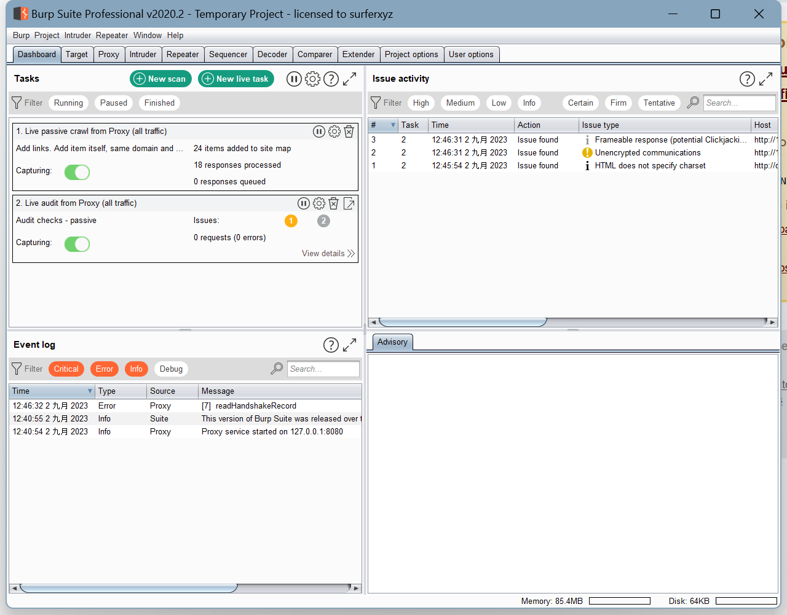

### 练习 Tomcat PUT 方法任意写文件漏洞（CVE-2017-12615），提供命令执行截图。

```shell
[root@localhost ~]# docker pull CVE-2017-12615
invalid reference format: repository name must be lowercase
[root@localhost ~]# docker search CVE-2017-12615
NAME                               DESCRIPTION                                     STARS     OFFICIAL   AUTOMATED
cved/cve-2017-12615                cve-2017-12615                                  1                    
nixawk/cve-2017-12615              https://github.com/nixawk/labs/blob/master/C…   0                    
pancontent/cve-2017-12615_tomcat                                                   0                    
xz0620/cve-2017-12615-ctf                                                          0                    
le3d1ng/cve-2017-12615                                                             0                    
brightsec/vulhub-tomcat            https://github.com/vulhub/vulhub/tree/master…   0                    
[root@localhost ~]# docker pull cved/cve-2017-12615
Using default tag: latest
latest: Pulling from cved/cve-2017-12615
Digest: sha256:534231c78beffc997cc71cb679948a81227c7090c6e7eaee7025ac9a327bc7b4
Status: Image is up to date for cved/cve-2017-12615:latest
docker.io/cved/cve-2017-12615:latest
[root@localhost ~]# docker images
REPOSITORY            TAG       IMAGE ID       CREATED         SIZE
mysql                 8         99afc808f15b   3 weeks ago     577MB
centos                7         eeb6ee3f44bd   23 months ago   204MB
cved/cve-2017-12615   latest    7633828fbea8   4 years ago     293MB
sagikazarmark/dvwa    latest    e901498e651a   6 years ago     359MB
[root@localhost ~]# docker run -d -p 8080:8080 cved/cve-2017-12615
f4efc12f4aebcaf007e7ec274409ded328d8740d1234c5abc9465d2363c9ab6d
```

安装好靶场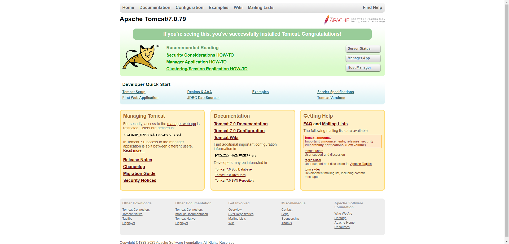

拦截请求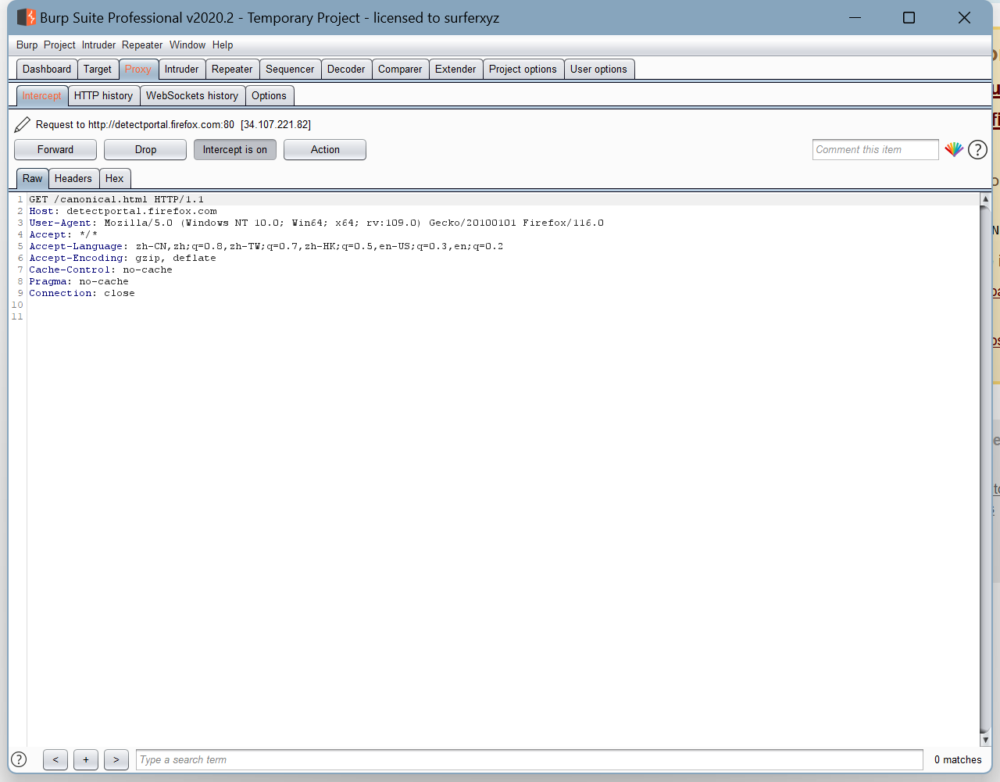

重写请求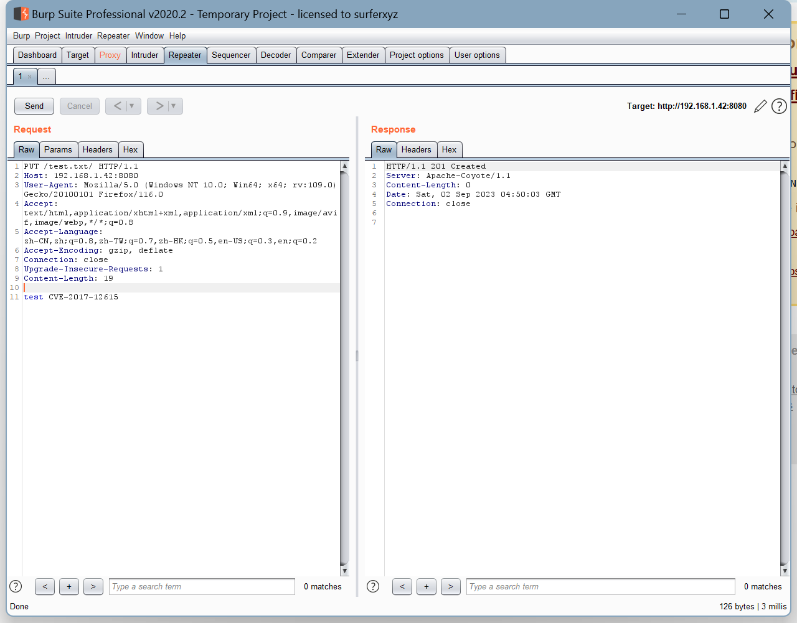

访问刚才写入的文件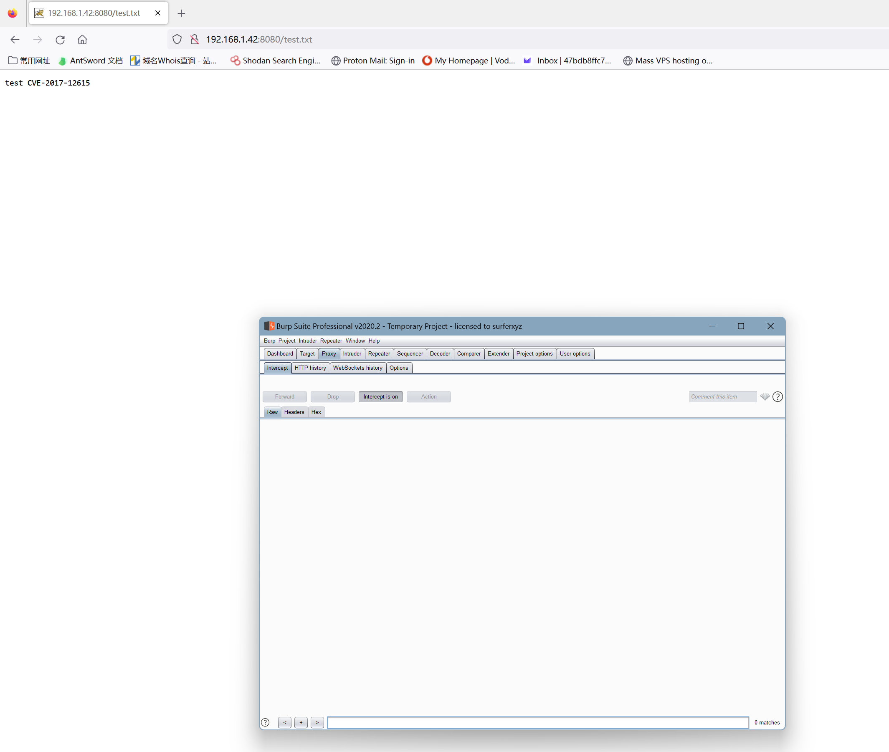

写入攻击POK

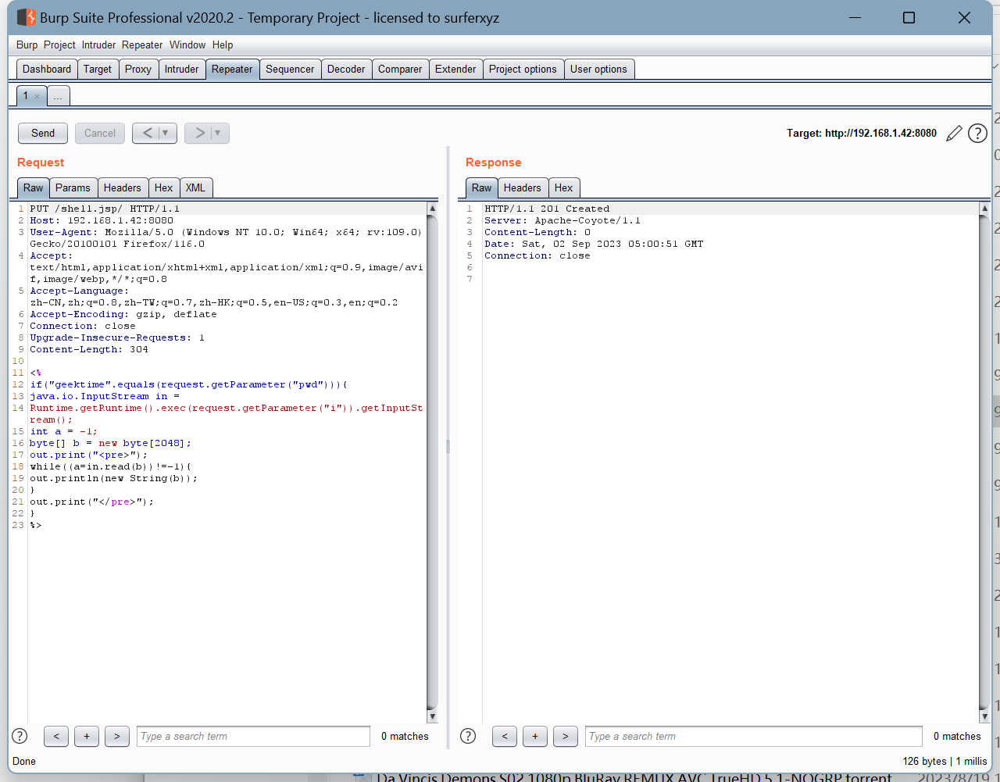

执行上传的webshell

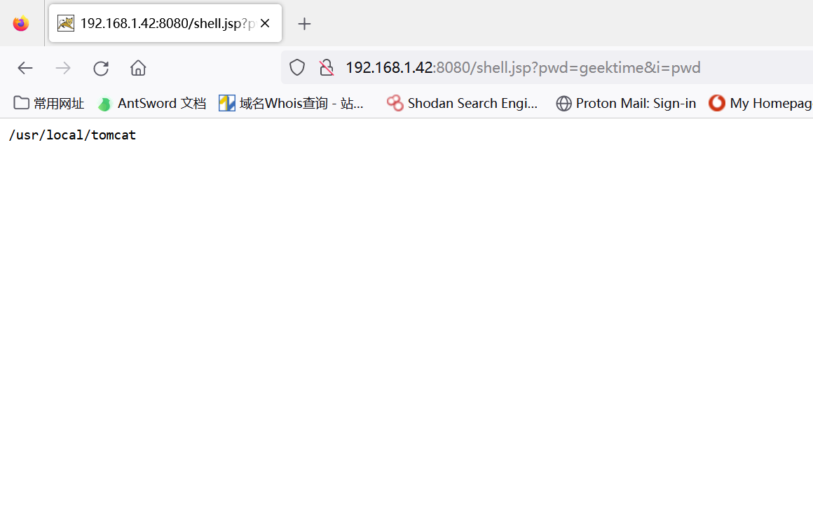

写入新的攻击POK

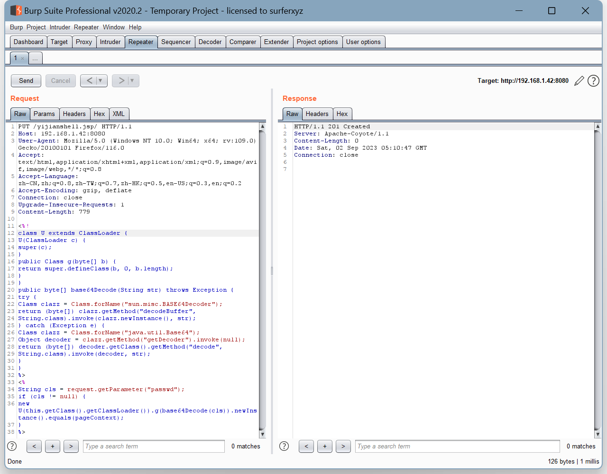

使用蚁剑测试连接

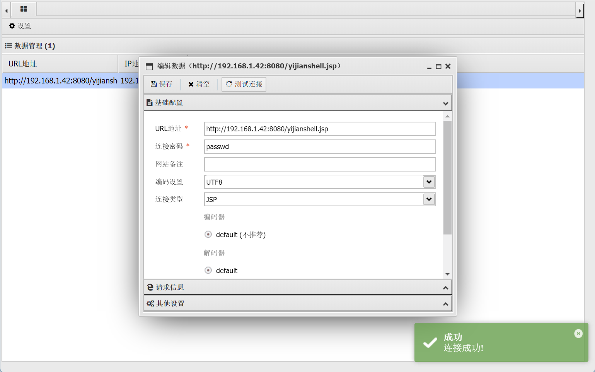

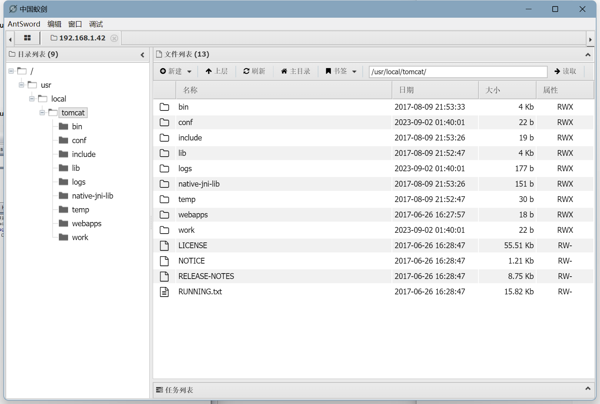

### 练习 S2-048 远程代码执行漏洞（CVE-2017-9791），提供命令执行截图。

```shell
[root@localhost ~]# docker pull docker.io/piesecurity/apache-struts2-cve-2017-5638
Using default tag: latest
latest: Pulling from piesecurity/apache-struts2-cve-2017-5638
9f0706ba7422: Pull complete 
d3942a742d22: Pull complete 
2b95a7bc6bf9: Pull complete 
e4c7597bbbc1: Pull complete 
5f5ed4ce77dc: Pull complete 
63038208f189: Pull complete 
1138b1f02201: Pull complete 
f027013454f1: Pull complete 
41cf8eaed89c: Pull complete 
08038cdd003c: Pull complete 
d4afc280bba7: Pull complete 
a0416d3a601b: Pull complete 
53046b5dd8b7: Pull complete 
4cd5bcee33b9: Pull complete 
Digest: sha256:381a90208031e7910555c99e7a88183389f5d159dcd118c2b98fd8ce196ab79e
Status: Downloaded newer image for piesecurity/apache-struts2-cve-2017-5638:latest
docker.io/piesecurity/apache-struts2-cve-2017-5638:latest
[root@localhost ~]# docker run -d -p 8081:8080 piesecurity/apache-struts2-cve-2017-5638:latest
8b260ae5dd778dea2b5a0ad40b2873781594bbc539f0207f280f2313449b8561
```

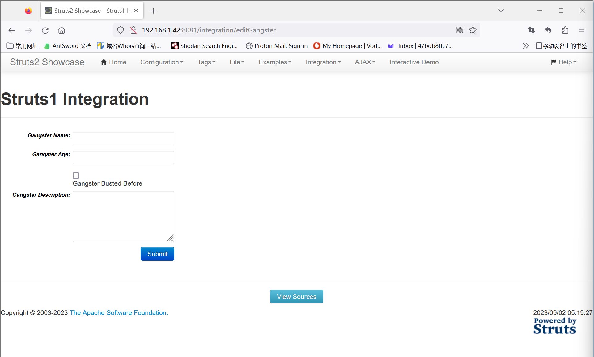

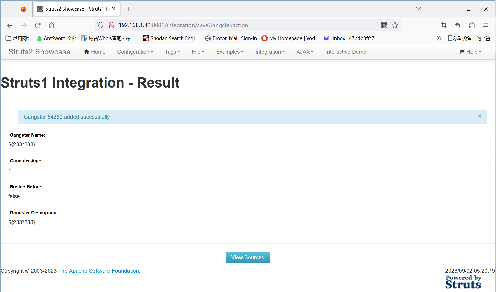

### 练习 JBoss 5.x/6.x 反序列化漏洞（CVE-2017-12149），提供命令执行截图。

```shell
[root@localhost ~]# docker pull docker.io/hackingpub/cve-2017-12149
Using default tag: latest
latest: Pulling from hackingpub/cve-2017-12149
762ae076e9a3: Pull complete 
23de19d3f13a: Pull complete 
88eb6f7cbbff: Pull complete 
4a068071674d: Pull complete 
b9eee10f8e2e: Pull complete 
a53360b376d7: Pull complete 
36f66cf89d4e: Pull complete 
bbe64581d885: Pull complete 
a5f9b940133c: Pull complete 
567a8978e415: Pull complete 
e58cfe1eedfe: Pull complete 
57cf9bf5a3ec: Pull complete 
792aaeb4bdcb: Pull complete 
bb266d48c965: Pull complete 
Digest: sha256:115c0b9def99465f9f2f838e9fef52450bca5db4b2e643f422a3879b69edfc66
Status: Downloaded newer image for hackingpub/cve-2017-12149:latest
docker.io/hackingpub/cve-2017-12149:latest
[root@localhost ~]# docker run -d -p 8083:8080 docker.io/hackingpub/cve-2017-12149:latest
d7b1828c1458b2641fd38714671b7c9f9915c756d1b967ef68911cf31ca2be6a

```

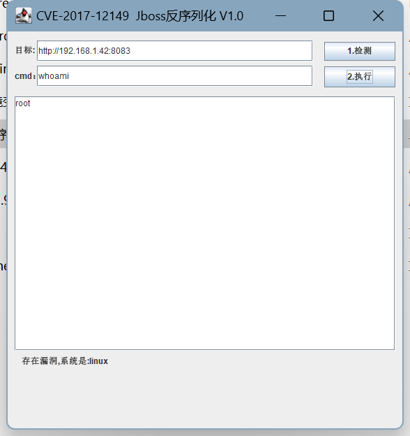

### 安装并使用 Nmap 扫描一个地址（本机、VPS、虚拟机环境都可以），提供扫描结果截图。

```shell
(base) [root@localhost ~]# nmap -A -T4 192.168.1.42
Starting Nmap 7.70 ( https://nmap.org ) at 2023-09-02 02:02 EDT
Nmap scan report for 192.168.1.42
Host is up (0.000078s latency).
Not shown: 996 closed ports
PORT     STATE SERVICE VERSION
22/tcp   open  ssh     OpenSSH 7.4 (protocol 2.0)
| ssh-hostkey: 
|   2048 69:8b:d5:c7:fa:96:6d:9a:89:49:08:fb:a5:38:36:3c (RSA)
|   256 ca:a0:41:b0:ff:f3:42:b2:5e:18:24:e6:b0:4c:80:af (ECDSA)
|_  256 03:fa:62:77:9a:e1:56:d7:c2:38:07:0a:66:ef:69:cc (ED25519)
8080/tcp open  http    Apache Tomcat/Coyote JSP engine 1.1
|_http-favicon: Apache Tomcat
|_http-open-proxy: Proxy might be redirecting requests
|_http-server-header: Apache-Coyote/1.1
|_http-title: Apache Tomcat/7.0.79
8081/tcp open  http    Apache Tomcat/Coyote JSP engine 1.1
|_http-server-header: Apache-Coyote/1.1
| http-title: Struts2 Showcase
|_Requested resource was showcase.action
8083/tcp open  http    Apache Tomcat/Coyote JSP engine 1.1
| http-methods: 
|_  Potentially risky methods: PUT DELETE TRACE
|_http-server-header: Apache-Coyote/1.1
|_http-title: Welcome to JBoss AS
MAC Address: 00:0C:29:4C:F5:C9 (VMware)
Device type: general purpose
Running: Linux 3.X|4.X
OS CPE: cpe:/o:linux:linux_kernel:3 cpe:/o:linux:linux_kernel:4
OS details: Linux 3.2 - 4.9
Network Distance: 1 hop

TRACEROUTE
HOP RTT     ADDRESS
1   0.08 ms 192.168.1.42

OS and Service detection performed. Please report any incorrect results at https://nmap.org/submit/ .
Nmap done: 1 IP address (1 host up) scanned in 10.57 seconds
```

### 以任一企业为关键词进行信息收集练习并汇总形成报告，禁止进行违规操作。

域名：dbappsecurity.com.cn

```shell
域名: dbappsecurity.com.cn
联系人: 杭州安恒信息技术股份有限公司
联系邮箱: ming.fu@dbappsecurity.com.cn
```

子域名查询

```shell
1 	ahdisk.dbappsecurity.com.cn
2 	ltc-file.dbappsecurity.com.cn
3 	cminio.dbappsecurity.com.cn
4 	m-oa.dbappsecurity.com.cn
5 	i-cpq.dbappsecurity.com.cn
6 	ltc.dbappsecurity.com.cn
7 	soar.dbappsecurity.com.cn
8 	partner.dbappsecurity.com.cn
9 	sumapsdk.dbappsecurity.com.cn
10 	support.dbappsecurity.com.cn
11 	minio.dbappsecurity.com.cn
12 	salescards-martech.dbappsecurity.com.cn
13 	auto-martech.dbappsecurity.com.cn
14 	marketing-martech.dbappsecurity.com.cn
15 	martech.dbappsecurity.com.cn
16 	threat.dbappsecurity.com.cn
17 	update2.dbappsecurity.com.cn
18 	security.dbappsecurity.com.cn
19 	baoxianfengkong.dbappsecurity.com.cn
20 	edr.dbappsecurity.com.cn
21 	gongyi.dbappsecurity.com.cn
22 	page-martech.dbappsecurity.com.cn
23 	sumap.dbappsecurity.com.cn
24 	ehr.dbappsecurity.com.cn
25 	zp.dbappsecurity.com.cn
26 	ailpha.dbappsecurity.com.cn
27 	internal6.dbappsecurity.com.cn
28 	tapi.dbappsecurity.com.cn
29 	ti.dbappsecurity.com.cn
30 	mssp.dbappsecurity.com.cn
31 	dsmp-hangzhou.dbappsecurity.com.cn
32 	download.dbappsecurity.com.cn
33 	anhengtong.dbappsecurity.com.cn
34 	product.dbappsecurity.com.cn
35 	oa.dbappsecurity.com.cn
36 	ztypt.dbappsecurity.com.cn
37 	internal10.dbappsecurity.com.cn
38 	nssa.dbappsecurity.com.cn
39 	seclab.dbappsecurity.com.cn
40 	display.dbappsecurity.com.cn
41 	aicso.dbappsecurity.com.cn
42 	update.dbappsecurity.com.cn
43 	bbs.dbappsecurity.com.cn
44 	waf.dbappsecurity.com.cn
45 	internal18.dbappsecurity.com.cn
46 	internal2.dbappsecurity.com.cn
47 	smtp.dbappsecurity.com.cn
48 	mail.dbappsecurity.com.cn
49 	moa.dbappsecurity.com.cn
50 	vpn.dbappsecurity.com.cn
51 	www1.dbappsecurity.com.cn
52 	dbappsecurity.com.cn
53 	www.dbappsecurity.com.cn
54 	aptcloud.dbappsecurity.com.cn
```

选择其中较新的：ailpha.dbappsecurity.com.cn

```shell
Registrant: 杭州安恒信息技术股份有限公司
Registrant Contact Email: ming.fu@dbappsecurity.com.cn
Sponsoring Registrar: 阿里云计算有限公司（万网）
```

企业信息

```shell
法定代表人：吴卓群
电话：0571-88380999
邮箱：info@dbappsecurity.com.cn
网址：www.dbappsecurity.com.cn
```

IP信息

```shell
ailpha.dbappsecurity.com.cn服务器iP：
当前解析：

中国 浙江 杭州 联通	60.12.5.93

中国 浙江 杭州 电信	115.233.206.245 
```

技术框架信息


端口主机信息

```shell
(base) [root@localhost ~]# nmap -A -T4 ailpha.dbappsecurity.com.cn
Starting Nmap 7.70 ( https://nmap.org ) at 2023-09-02 20:24 EDT
Stats: 0:00:29 elapsed; 0 hosts completed (1 up), 1 undergoing Service Scan
Service scan Timing: About 33.33% done; ETC: 20:24 (0:00:22 remaining)
Stats: 0:00:56 elapsed; 0 hosts completed (1 up), 1 undergoing Script Scan
NSE Timing: About 98.31% done; ETC: 20:25 (0:00:00 remaining)
Stats: 0:01:02 elapsed; 0 hosts completed (1 up), 1 undergoing Script Scan
NSE Timing: About 98.31% done; ETC: 20:25 (0:00:00 remaining)
Nmap scan report for ailpha.dbappsecurity.com.cn (60.12.5.93)
Host is up (0.0089s latency).
Other addresses for ailpha.dbappsecurity.com.cn (not scanned): 115.233.206.245
Not shown: 997 filtered ports
PORT     STATE SERVICE   VERSION
80/tcp   open  htt
...
443/tcp  open  ssl/https
...
8080/tcp open  http      Tengine httpd
...
Device type: general purpose|WAP|storage-misc|specialized
Running (JUST GUESSING): Linux 2.6.X|3.X (91%), Ruckus embedded (87%), Synology DiskStation Manager 5.X (87%), Crestron 2-Series (87%), Asus embedded (86%), HP embedded (85%)
OS CPE: cpe:/o:linux:linux_kernel:2.6.32 cpe:/o:linux:linux_kernel:3 cpe:/h:ruckus:zoneflex_r710 cpe:/a:synology:diskstation_manager:5.2 cpe:/o:crestron:2_series cpe:/h:asus:rt-n56u cpe:/o:linux:linux_kernel:3.4 cpe:/h:hp:p2000_g3
Aggressive OS guesses: Linux 2.6.32 (91%), Linux 2.6.32 - 3.10 (90%), Linux 2.6.32 - 3.9 (90%), Linux 2.6.32 - 3.13 (88%), Linux 2.6.32 - 2.6.39 (87%), Linux 2.6.32 - 3.1 (87%), Linux 2.6.39 (87%), Linux 3.10 (87%), Linux 3.11 (87%), Linux 3.2 (87%)
No exact OS matches for host (test conditions non-ideal).
Network Distance: 14 hops

TRACEROUTE (using port 80/tcp)
HOP RTT      ADDRESS
1   0.19 ms  192.168.1.1
2   3.52 ms  183.156.87.129
3   7.79 ms  183.159.251.145
4   3.40 ms  183.159.251.147
5   6.47 ms  122.225.218.185
6   9.92 ms  202.97.78.22
7   13.82 ms 219.158.45.165
8   ... 9
10  9.81 ms  124.160.66.1
11  6.37 ms  124.90.33.214
12  ... 13
14  8.28 ms  60.12.5.93

OS and Service detection performed. Please report any incorrect results at https://nmap.org/submit/ .
Nmap done: 1 IP address (1 host up) scanned in 106.74 seconds
```

