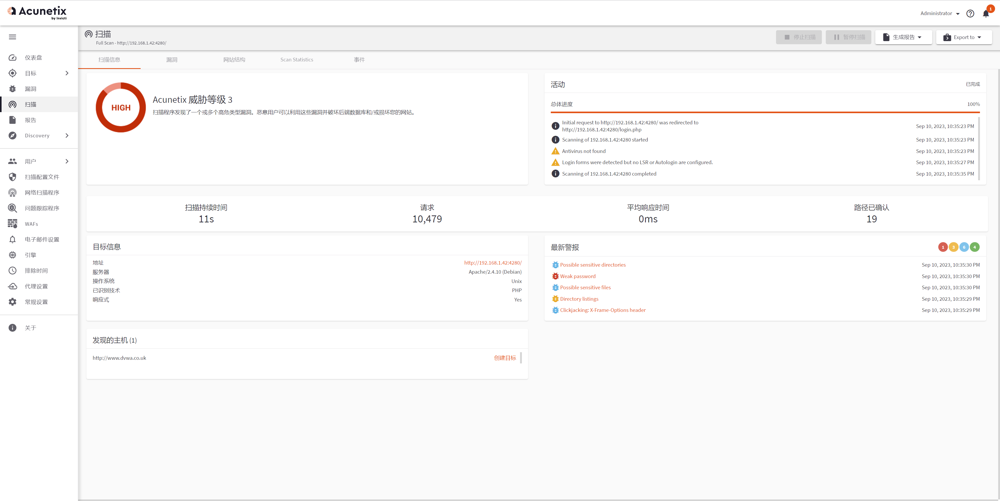
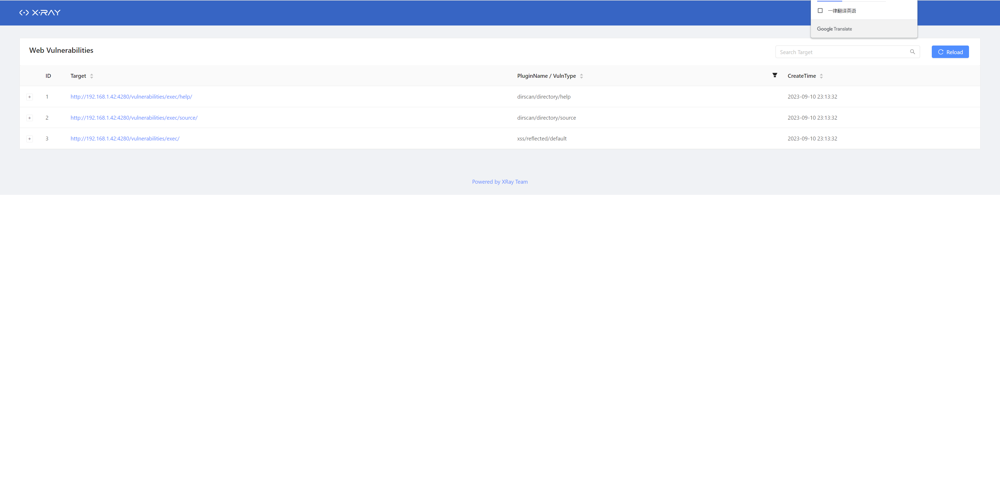
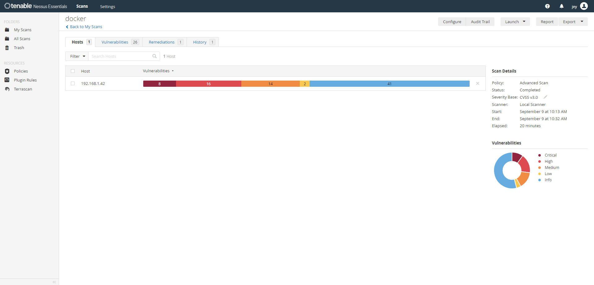
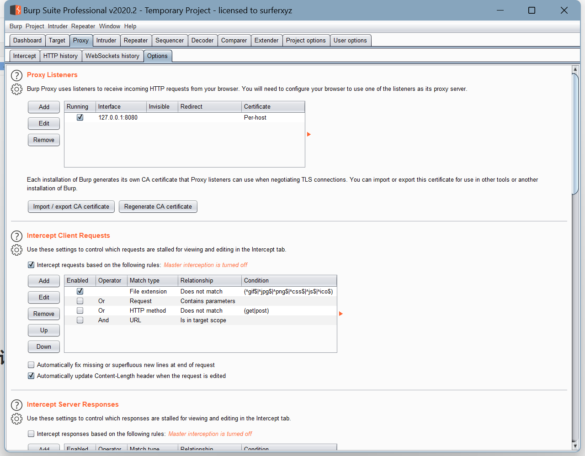
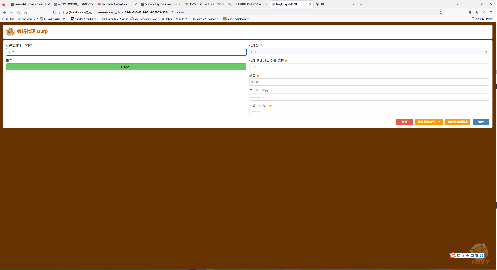
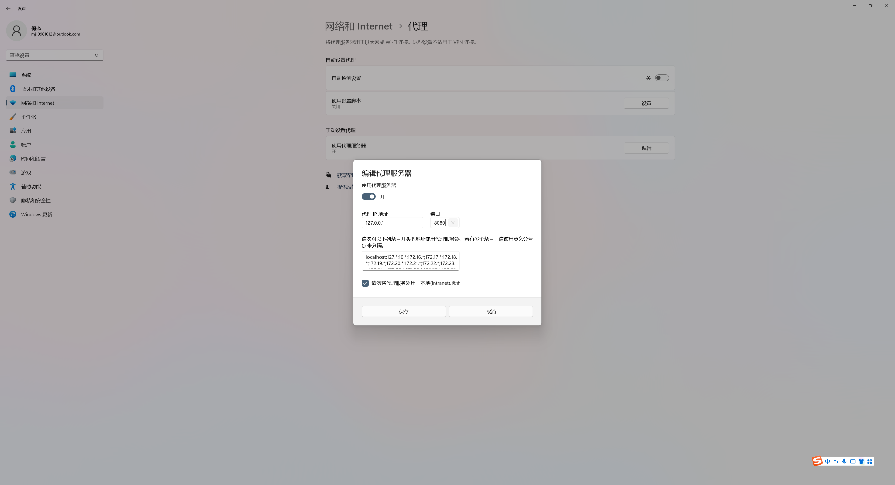
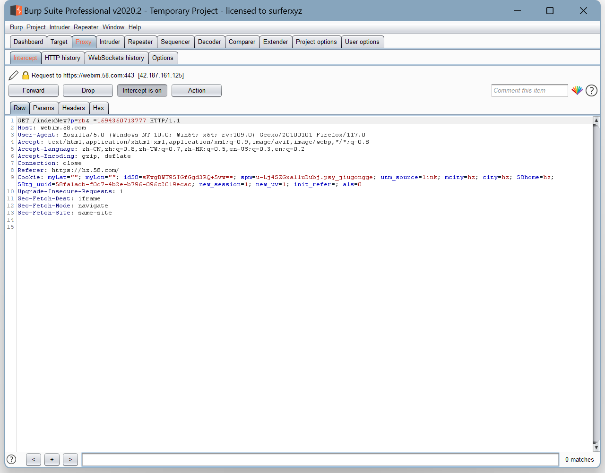

### 分别使用 AWVS 和 Xray（被动扫描模式）去扫描任一 SRC 允许测试的目标，对比扫描结果的不同；

下载AWVS镜像

```shell
[root@localhost ~]# docker pull dockermi3aka/awvs
Using default tag: latest
latest: Pulling from dockermi3aka/awvs
1fe172e4850f: Pull complete 
9328f0e847bf: Pull complete 
Digest: sha256:e1a28e5e8333a76b98478e3a366466160d63b4b7230359d8f247e82b8816cbde
Status: Downloaded newer image for dockermi3aka/awvs:latest
docker.io/dockermi3aka/awvs:latest
```

启动AWVS

```shell
[root@localhost ~]# docker run -dit -p 3443:3443 dockermi3aka/awvs
65dbccae9c4fc576bccb78024a72c3ebd8013a3114ed2adbaaa1714bc95dea4b
```

AWVS扫描结果



XRAY扫描结果



### 使用 Nessus 扫描任一主机，要求使用全端口扫描，提供主机扫描报告；



### 安装 Burp，分别在本机上实现全局代理和局部代理，提供设置过程的说明文档；



局部代理



全局代理



### 利用 Burp 实现对 HTTPS 站点的抓包。

