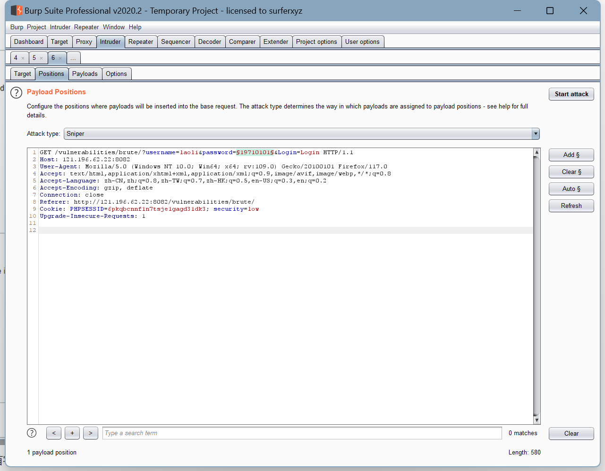

### 使用 Burp 的 Discover Content 功能爬取任意站点的目录，给出爬取过程的说明文档、站点树截图；

### 分别使用 Burp Scan 的主动扫描和被动扫描功能对 DVWA 站点进行扫描，输出扫描报告；

主动扫描


被动扫描


### Burp Intruder 爆破题目

靶场地址：[ http://121.196.62.22:8082/vulnerabilities/brute/](http://121.196.62.22:8082/vulnerabilities/brute/)

靶场开放时间：2023.9.9 ~ 2023.9.24

管理员账号 / 密码：admin/password

注意事项：爆破成功的同学请勿修改任何账号的密码，以免影响其他同学正常作业。

- 老李今年 52 岁了，他最近也在学习网络安全，为了方便练习，他在 DVWA 靶场中增设了一个自己的账号，密码就是他的生日，请你想办法破解出他的账号密码。

  

  

  

  

  

  

  

  

  

  

- Cookie 老师在 DVWA 靶场中设置了一个账号 Geektime（注意首字母大写），且在靶场中的某处存放了一个文件名为 geekbang.txt 的密码字典，请你想办法找到该字典并尝试爆破，最终获取到账号 Geektime 的正确密码。

  ```shell
  http://121.196.62.22:8082/geekbang.txt
  love
  buster
  1234567
  soccer
  hockey
  killer
  george
  admin
  sexy
  geektime666
  123456
  andrew
  charlie
  superman
  password
  dallas
  ruler
  jessica
  panties
  win7
  root
  xiaoming666
  ```

  

  

### 在不依赖于 DVWA 后端数据库的情况，如何通过前端验证的方法判断 DVWA 中的注入点是数字型注入还是字符型注入？（提示：用假设法进行逻辑判断）

**1. 数字型注入:**

- 假设注入点是数字型的。
- 输入一个普通数字，例如`1`。如果应用程序正常工作，则继续。
- 尝试输入一个数学表达式，例如`1+1`。如果应用程序显示`2`（或其他相关的正常响应），则这可能是一个数字型注入点。
- 尝试输入不完整的SQL语句，例如`1 AND 1=1`和`1 AND 1=2`。如果前者的响应与正常相同，而后者的响应不同或出错，这是数字型注入的另一个迹象。

**2. 字符型注入:**

- 假设注入点是字符型的。
- 输入一个普通字符串，例如`test`。如果应用程序正常工作，则继续。
- 尝试输入一个带有单引号的字符串，例如`test'`。如果应用程序返回一个数据库错误，这可能表明它是字符型注入点。
- 可以尝试更复杂的负载，例如`test' AND '1'='1`和`test' AND '1'='2`。如果前者的响应与正常相同，而后者的响应不同或出错，这是字符型注入的另一个迹象。

总的来说，基于假设法的逻辑判断是基于预期和实际的应用程序响应之间的差异来确定注入点的类型。通过观察这些响应，可以确定注入点是数字型还是字符型。